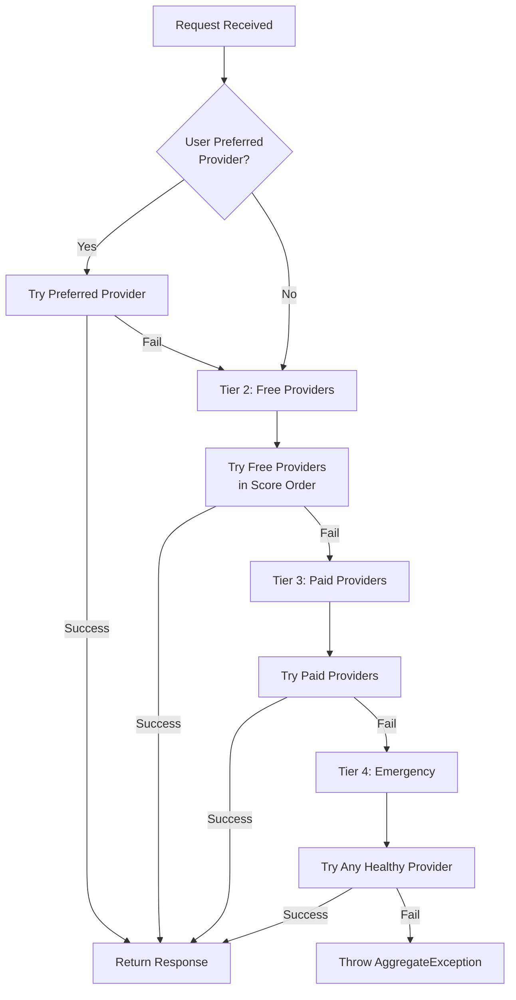

# ADR 002: Tiered Routing Strategy

**Status:** Accepted  
**Date:** 2026-01-28

> **ULTRA MISER MODE™ Engineering**: Why pay for AI when you can build a Rube Goldberg machine that tries 47 free providers first? This isn't just routing—it's financial self-respect encoded as an algorithm.

---

## Context

Synaxis operates in a unique ecosystem: a landscape of AI providers offering generous free tiers alongside paid alternatives. The challenge is not merely routing requests to available providers, but doing so in a way that maximizes free tier utilization while maintaining enterprise-grade reliability.

The naive approach—random selection or round-robin—fails because:

1. **Free tiers have quotas**: Hitting rate limits wastes time and degrades user experience
2. **Providers fail differently**: Some return 429 (rate limited), others 5xx (server errors), others simply timeout
3. **Not all providers are equal**: Some have better latency, reliability, or model availability
4. **User preferences matter**: Sometimes a user explicitly wants a specific provider

We needed a routing strategy that embodies **ULTRA MISER MODE™**: treat paid tiers as a last resort, not a default.

---

## Decision

We implemented a **4-Tier Fallback Strategy** with health-aware selection and intelligent scoring.

### The Four Tiers

| Tier | Priority | Description | Use Case |
|------|----------|-------------|----------|
| **Tier 1** | Highest | User-preferred provider | Explicit provider selection via headers or config |
| **Tier 2** | High | Free tier providers | **ULTRA MISER MODE™** default—exhaust these first |
| **Tier 3** | Medium | Paid providers | Fallback when free tiers exhausted |
| **Tier 4** | Emergency | Any healthy provider | Last resort—ignores quotas, uses whatever works |

### Core Components

#### 1. FallbackOrchestrator

The brain of the routing system. Implements the tiered fallback logic:

```csharp
public async Task<ChatResponse> ExecuteWithFallbackAsync(
    CanonicalRequest request,
    CancellationToken cancellationToken)
{
    // Tier 1: User preference
    if (request.PreferredProvider != null)
    {
        var result = await TryExecuteAsync(request.PreferredProvider);
        if (result.IsSuccess) return result.Value;
    }

    // Tier 2: Free providers (ULTRA MISER MODE™)
    var freeCandidates = await _smartRouter.GetCandidatesAsync(
        request.Model, tier: 2);
    foreach (var candidate in freeCandidates)
    {
        var result = await TryExecuteAsync(candidate);
        if (result.IsSuccess) return result.Value;
    }

    // Tier 3: Paid providers (when free tiers exhausted)
    var paidCandidates = await _smartRouter.GetCandidatesAsync(
        request.Model, tier: 3);
    foreach (var candidate in paidCandidates)
    {
        var result = await TryExecuteAsync(candidate);
        if (result.IsSuccess) return result.Value;
    }

    // Tier 4: Emergency mode (any healthy provider)
    var emergencyCandidates = await _smartRouter.GetCandidatesAsync(
        request.Model, tier: null, ignoreQuota: true);
    // ... try each until one succeeds
}
```

#### 2. SmartRouter

Responsible for candidate selection within each tier:

- **Model Resolution:** Maps canonical model IDs to provider-specific model paths
- **Health Filtering:** Excludes providers marked unhealthy in Redis
- **Quota Checking:** Respects per-provider rate limits
- **Score Calculation:** Ranks candidates by composite score

#### 3. Scoring Algorithm

Each candidate receives a score based on:

```csharp
Score = (ReliabilityWeight × SuccessRate) +
        (LatencyWeight × (1 - NormalizedLatency)) +
        (CostWeight × (1 - CostFactor))
```

Where:
- **SuccessRate:** Rolling 5-minute window of successful requests
- **NormalizedLatency:** Response time relative to provider baseline
- **CostFactor:** 0 for free tiers, 1 for paid tiers

#### 4. Health Management

Providers are marked unhealthy based on error type:

| Error Type | Cooldown | Severity | Action |
|------------|----------|----------|--------|
| 429 Too Many Requests | 60s | Warning | Mark unhealthy, retry next provider |
| 401 Unauthorized | 1 hour | Critical | Mark unhealthy, alert admin |
| 5xx Server Error | 30s | Error | Mark unhealthy, retry next provider |
| 400/404 Client Error | None | Error | Don't penalize provider |

Health status is stored in Redis with TTL matching the cooldown period.

---

## Diagram



---

## Consequences

### Positive

- **Cost Optimization:** Free tiers are exhausted before paid providers are considered, often resulting in $0 spend per request
- **Resilience:** 4-tier fallback ensures requests succeed even when multiple providers fail
- **Intelligence:** Health-aware selection prevents wasted requests on known-bad endpoints
- **Transparency:** Users can explicitly prefer providers while still benefiting from fallback
- **ULTRA MISER MODE™ Compliance:** The system treats paid tiers as a failure mode, not a default

### Negative

- **Latency Trade-off:** Trying multiple providers adds latency (mitigated by parallel attempts in emergency mode)
- **Complexity:** The scoring algorithm and health management add cognitive overhead
- **Redis Dependency:** Health and quota tracking require Redis availability

### Mitigations

- **Circuit Breaker Pattern:** Providers that repeatedly fail are temporarily excluded
- **Parallel Emergency Mode:** Tier 4 attempts can be made in parallel to reduce latency
- **Graceful Degradation:** If Redis is unavailable, the system falls back to simple round-robin

---

## Related Decisions

- [ADR-001: Stream-Native CQRS](./001-stream-native-cqrs.md) — How the routing integrates with the CQRS pipeline
- [ADR-003: Authentication Architecture](./003-authentication-architecture.md) — How authentication affects routing decisions (e.g., paid users may skip Tier 2)

---

> *"A routing algorithm that doesn't prioritize free tiers is just a very expensive random number generator."* — ULTRA MISER MODE™ Principle #12
