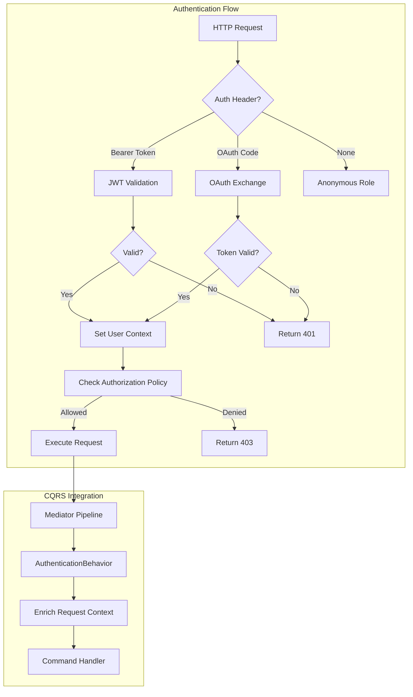

# ADR 003: Authentication Architecture

**Status:** Accepted  
**Date:** 2026-01-30

> **ULTRA MISER MODE™ Engineering**: We could have built a custom auth system with 47 microservices and a $500/month identity provider bill. Instead, we chose JWT and OAuth—because even authentication should refuse to pay for premium features.

---

## Context

Synaxis requires a robust authentication and authorization system that balances security with the project's core philosophy: **ULTRA MISER MODE™**. The system must:

1. **Secure the API:** Prevent unauthorized access to AI inference endpoints
2. **Support Multiple Auth Methods:** JWT tokens for service-to-service, OAuth for user authentication
3. **Integrate with CQRS:** Authentication must work seamlessly with the Mediator pipeline
4. **Minimize Costs:** Avoid expensive third-party auth providers when possible
5. **Enable Admin Access:** Secure access to the Admin Web UI for provider management

The challenge was designing an auth system that is enterprise-grade without the enterprise-grade price tag.

---

## Decision

We implemented a **dual-mode authentication architecture** using JWT for API access and OAuth 2.0 for user authentication, with a unified authorization layer.

### Authentication Modes

#### Mode 1: JWT Token Authentication (API Access)

For programmatic access to the inference API:

```csharp
// JWT Validation Middleware
public class JwtAuthenticationMiddleware
{
    public async Task InvokeAsync(HttpContext context)
    {
        var token = ExtractBearerToken(context);
        if (token == null)
        {
            context.Response.StatusCode = 401;
            return;
        }

        var principal = ValidateToken(token, _jwtSecret);
        if (principal == null)
        {
            context.Response.StatusCode = 401;
            return;
        }

        context.User = principal;
        await _next(context);
    }
}
```

**Characteristics:**
- Stateless validation (no database lookup per request)
- Self-contained claims (user ID, roles, quotas)
- Configurable expiration (default: 24 hours)
- Refresh token support for long-lived sessions

#### Mode 2: OAuth 2.0 (User Authentication)

For Admin Web UI access and third-party integrations:

```csharp
// OAuth Strategy Pattern
public interface IOAuthProvider
{
    string Name { get; }
    Task<OAuthTokenResponse> ExchangeCodeAsync(string code);
    Task<OAuthUserInfo> GetUserInfoAsync(string accessToken);
}

public class GitHubOAuthProvider : IOAuthProvider { ... }
public class GoogleOAuthProvider : IOAuthProvider { ... }
```

**Supported Providers:**
- GitHub OAuth (for developer-centric deployments)
- Google OAuth (for enterprise integrations)
- Generic OIDC (for custom identity providers)

### Authorization Architecture

#### Role-Based Access Control (RBAC)

```csharp
public enum UserRole
{
    Anonymous,      // No authentication (rate-limited)
    User,           // Authenticated API user
    Admin,          // Full admin access
    Service         // Internal service account
}

public static class Policies
{
    public const string RequireUser = "RequireUser";
    public const string RequireAdmin = "RequireAdmin";
    public const string AllowAnonymous = "AllowAnonymous";
}
```

#### Permission Matrix

| Endpoint | Anonymous | User | Admin | Service |
|----------|-----------|------|-------|---------|
| `/v1/chat/completions` | Rate-limited | ✓ | ✓ | ✓ |
| `/v1/models` | ✓ | ✓ | ✓ | ✓ |
| `/admin/providers` | ✗ | ✗ | ✓ | ✓ |
| `/admin/health` | ✗ | ✗ | ✓ | ✓ |
| `/health/*` | ✓ | ✓ | ✓ | ✓ |

### Integration with CQRS Pipeline

Authentication is enforced at two levels:

#### 1. Middleware Level (Early Rejection)

```csharp
// Program.cs
app.UseAuthentication();
app.UseAuthorization();

// Controllers
[Authorize(Policy = Policies.RequireUser)]
[ApiController]
public class ChatCompletionController : ControllerBase
{
    // ...
}
```

#### 2. Mediator Pipeline (Context Enrichment)

```csharp
public class AuthenticationBehavior<TRequest, TResponse>
    : IPipelineBehavior<TRequest, TResponse>
    where TRequest : notnull
{
    public async Task<TResponse> Handle(
        TRequest request,
        CancellationToken cancellationToken,
        RequestHandlerDelegate<TResponse> next)
    {
        // Enrich request with user context
        if (request is IAuthenticatedRequest authRequest)
        {
            authRequest.UserId = _currentUserService.UserId;
            authRequest.Roles = _currentUserService.Roles;
        }

        return await next();
    }
}
```

### Security Hardening

#### JWT Configuration

```csharp
// appsettings.json
{
  "Synaxis": {
    "InferenceGateway": {
      "JwtSecret": "${JWT_SECRET}",
      "JwtIssuer": "synaxis-gateway",
      "JwtAudience": "synaxis-api",
      "JwtExpirationHours": 24
    }
  }
}
```

**Security Measures:**
- HS256 algorithm (symmetric key, configurable secret)
- Issuer and audience validation
- Token expiration enforcement
- No sensitive data in JWT payload (only IDs and roles)

#### Rate Limiting Integration

Authentication status affects rate limits:

```csharp
// Anonymous: 10 requests/minute
// Authenticated: 100 requests/minute
// Admin: 1000 requests/minute
// Service: Unlimited (internal)

public class RateLimitingMiddleware
{
    public async Task InvokeAsync(HttpContext context)
    {
        var tier = GetRateLimitTier(context.User);
        var limit = _rateLimits[tier];
        
        if (await _rateLimiter.IsAllowedAsync(clientId, limit))
        {
            await _next(context);
        }
        else
        {
            context.Response.StatusCode = 429;
            await context.Response.WriteAsync("Rate limit exceeded");
        }
    }
}
```

---

## Diagram



---

## Consequences

### Positive

- **Cost Efficiency:** JWT validation is stateless—no expensive auth provider calls per request
- **Flexibility:** Dual-mode supports both API keys (JWT) and user login (OAuth)
- **Security:** Industry-standard protocols (JWT, OAuth 2.0) with proper hardening
- **Integration:** Seamless integration with ASP.NET Core auth middleware and Mediator pipeline
- **ULTRA MISER MODE™ Compliance:** Self-hosted auth eliminates per-user licensing costs

### Negative

- **Secret Management:** JWT secrets must be securely managed (environment variables, not code)
- **Token Revocation:** Stateless JWTs cannot be revoked instantly (mitigated by short expiration)
- **OAuth Complexity:** Supporting multiple OAuth providers requires maintenance

### Mitigations

- **Short Expiration:** JWTs expire after 24 hours, limiting exposure if compromised
- **Refresh Tokens:** Long-lived refresh tokens enable seamless re-authentication
- **Secret Rotation:** JWT secrets can be rotated without downtime
- **Redis Blacklist:** Critical tokens can be blacklisted in Redis for instant revocation

---

## Related Decisions

- [ADR-001: Stream-Native CQRS](./001-stream-native-cqrs.md) — How authentication integrates with the CQRS pipeline
- [ADR-002: Tiered Routing Strategy](./002-tiered-routing-strategy.md) — How authentication status affects routing (e.g., authenticated users may get priority)

---

> *"The best authentication system is one that keeps the bad guys out and the free tier in."* — ULTRA MISER MODE™ Principle #23
