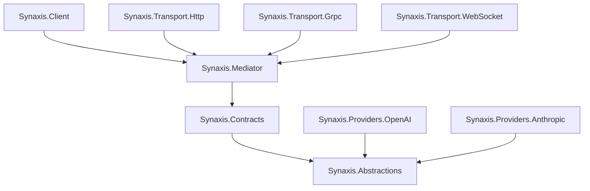

# Package Architecture

> **TL;DR**: Synaxis uses a 4-tier package architecture with strict dependency boundaries to minimize SDK dependencies while supporting multiple deployment patterns.

## 📦 The Four Tiers

Synaxis is organized into four core layers, each with specific responsibilities and dependency constraints:

```
┌─────────────────────────────────────┐
│      Tier 4: Synaxis.Client         │  ← High-level SDK
│         (Developer-Friendly)         │
└─────────────────┬───────────────────┘
                  │ depends on
┌─────────────────▼───────────────────┐
│      Tier 3: Synaxis.Mediator       │  ← CQRS Engine
│      (Transport Abstraction)         │
└─────────────────┬───────────────────┘
                  │ depends on
┌─────────────────▼───────────────────┐
│     Tier 2: Synaxis.Contracts       │  ← Request/Response DTOs
│        (Versioned Messages)          │
└─────────────────┬───────────────────┘
                  │ depends on
┌─────────────────▼───────────────────┐
│   Tier 1: Synaxis.Abstractions      │  ← Core Interfaces
│        (Zero Dependencies)           │
└─────────────────────────────────────┘
```

### Dependency Rules

**Rule #1**: Dependencies flow **down only**. Higher tiers depend on lower tiers, never the reverse.

**Rule #2**: Each tier can **only reference the tier immediately below it**.

**Rule #3**: Abstractions has **zero external dependencies** (only .NET runtime).

## 🏛️ Tier 1: Synaxis.Abstractions

**Purpose**: Define core contracts that all other packages implement or consume.

**Dependencies**: None (only .NET runtime)

**Key Interfaces**:
```csharp
namespace Synaxis.Abstractions.Execution
{
    public interface ICommandExecutor
    {
        Task<TResponse> ExecuteAsync<TResponse>(
            ICommand<TResponse> command,
            CancellationToken cancellationToken = default);
    }

    public interface IStreamExecutor
    {
        IAsyncEnumerable<TItem> ExecuteAsync<TItem>(
            IStreamQuery<TItem> query,
            CancellationToken cancellationToken = default);
    }
}

namespace Synaxis.Abstractions.Providers
{
    public interface IChatProvider : IProviderClient
    {
        Task<object> ChatAsync(
            IEnumerable<object> messages,
            string model,
            object? options = null,
            CancellationToken cancellationToken = default);
    }
}
```

**Why Zero Dependencies?**
- SDK users can reference abstractions for mocking without pulling in heavy dependencies
- Test projects only need abstractions + their mocking library
- Custom transport implementations don't need full Synaxis stack

**Stability**: Changes rarely. This is the most stable package.

## 📄 Tier 2: Synaxis.Contracts

**Purpose**: Define request/response DTOs with versioning support.

**Dependencies**: 
- `Synaxis.Abstractions`
- `System.Text.Json` (for serialization)
- `protobuf-net` (for gRPC contracts)

**Structure**:
```
Synaxis.Contracts/
├── V1/
│   ├── Chat/
│   │   ├── ChatCompletionRequest.cs
│   │   ├── ChatCompletionResponse.cs
│   │   └── StreamingChatRequest.cs
│   ├── Embeddings/
│   │   ├── EmbeddingRequest.cs
│   │   └── EmbeddingResponse.cs
│   └── Auth/
│       └── ProviderCredentials.cs
├── V2/
│   └── (Future versions)
└── Common/
    └── ErrorResponse.cs
```

**Key Principles**:

1. **Immutable DTOs**: All properties are init-only
2. **Versioned Namespaces**: Breaking changes get new namespace (V2, V3, etc.)
3. **Minimal Logic**: Pure data transfer objects, no business logic
4. **Serialization Attributes**: Support both JSON and Protobuf

**Example**:
```csharp
namespace Synaxis.Contracts.V1.Chat
{
    using System.Text.Json.Serialization;

    public sealed record ChatCompletionRequest : ICommand<ChatCompletionResponse>
    {
        [JsonPropertyName("model")]
        public required string Model { get; init; }

        [JsonPropertyName("messages")]
        public required IReadOnlyList<ChatMessage> Messages { get; init; }

        [JsonPropertyName("temperature")]
        public float? Temperature { get; init; }

        [JsonPropertyName("maxTokens")]
        public int? MaxTokens { get; init; }
    }
}
```

**Versioning Strategy**: See [ADR-015: Contracts Versioning Strategy](../adr/015-contracts-versioning-strategy.md)

## ⚙️ Tier 3: Synaxis.Mediator

**Purpose**: CQRS implementation with transport-agnostic execution.

**Dependencies**:
- `Synaxis.Abstractions`
- `Synaxis.Contracts`
- `Mediator` (martinothamar - source generated)
- `Microsoft.Extensions.DependencyInjection`

**Key Components**:

### 1. Command/Query Handlers
```csharp
public class ChatCompletionHandler 
    : ICommandHandler<ChatCompletionRequest, ChatCompletionResponse>
{
    private readonly IChatProvider _chatProvider;

    public async Task<ChatCompletionResponse> HandleAsync(
        ChatCompletionRequest request,
        CancellationToken cancellationToken)
    {
        var result = await _chatProvider.ChatAsync(
            request.Messages,
            request.Model,
            cancellationToken: cancellationToken);

        return MapToChatCompletionResponse(result);
    }
}
```

### 2. Pipeline Behaviors
```csharp
public class LoggingBehavior<TMessage, TResponse> 
    : IPipelineBehavior<TMessage, TResponse>
    where TMessage : IMessage
{
    public async ValueTask<TResponse> Handle(
        TMessage message,
        MessageHandlerDelegate<TMessage, TResponse> next,
        CancellationToken cancellationToken)
    {
        _logger.LogInformation("Handling {MessageType}", typeof(TMessage).Name);
        var response = await next(message, cancellationToken);
        _logger.LogInformation("Handled {MessageType}", typeof(TMessage).Name);
        return response;
    }
}
```

### 3. Stream Executors
```csharp
public class StreamInferenceHandler 
    : IStreamQueryHandler<StreamInferenceQuery, ChatChunk>
{
    public async IAsyncEnumerable<ChatChunk> HandleAsync(
        StreamInferenceQuery query,
        [EnumeratorCancellation] CancellationToken cancellationToken)
    {
        await foreach (var chunk in _chatProvider.StreamAsync(query.Messages, cancellationToken))
        {
            yield return chunk;
        }
    }
}
```

**Registration**:
```csharp
services.AddMediator(options =>
{
    options.ServiceLifetime = ServiceLifetime.Scoped;
});

services.AddSingleton<IPipelineBehavior<object, object>, LoggingBehavior<object, object>>();
services.AddSingleton<IPipelineBehavior<object, object>, ValidationBehavior<object, object>>();
services.AddSingleton<IPipelineBehavior<object, object>, MetricsBehavior<object, object>>();
```

## 🎁 Tier 4: Synaxis.Client

**Purpose**: High-level SDK with fluent API and convenience methods.

**Dependencies**:
- `Synaxis.Abstractions`
- `Synaxis.Contracts`
- `Synaxis.Mediator`
- `Microsoft.Extensions.Http` (for HttpClient factory)

**Key Features**:

### 1. Fluent Configuration
```csharp
var client = new SynaxisClientBuilder()
    .UseHttpTransport("https://api.synaxis.io")
    .WithApiKey(Environment.GetEnvironmentVariable("SYNAXIS_API_KEY"))
    .WithDefaultModel("gpt-4o")
    .WithRetries(maxAttempts: 3)
    .WithTimeout(TimeSpan.FromSeconds(30))
    .Build();
```

### 2. Convenience Methods
```csharp
public class SynaxisClient
{
    private readonly ICommandExecutor _executor;
    private readonly IStreamExecutor _streamExecutor;

    // Shorthand for common operations
    public Task<ChatCompletionResponse> ChatAsync(
        string prompt,
        string? model = null,
        CancellationToken cancellationToken = default)
    {
        var request = new ChatCompletionRequest
        {
            Model = model ?? _defaultModel,
            Messages = [new ChatMessage("user", prompt)]
        };

        return _executor.ExecuteAsync<ChatCompletionResponse>(request, cancellationToken);
    }

    // Streaming with language-native async enumerable
    public IAsyncEnumerable<ChatChunk> StreamChatAsync(
        string prompt,
        string? model = null,
        CancellationToken cancellationToken = default)
    {
        var query = new StreamInferenceQuery
        {
            Model = model ?? _defaultModel,
            Messages = [new ChatMessage("user", prompt)]
        };

        return _streamExecutor.ExecuteAsync<ChatChunk>(query, cancellationToken);
    }
}
```

### 3. Typed Responses
```csharp
// Strongly-typed API
var response = await client.ChatAsync("Explain quantum computing");
Console.WriteLine(response.Content);

// Streaming
await foreach (var chunk in client.StreamChatAsync("Write a story"))
{
    Console.Write(chunk.Delta);
}
```

## 🧩 Supporting Packages

### Transport Packages
```
Synaxis.Transport.Http      → HTTP REST + SSE
Synaxis.Transport.Grpc      → gRPC streaming
Synaxis.Transport.WebSocket → WebSocket bi-directional
```

### Provider Packages
```
Synaxis.Providers.OpenAI    → OpenAI integration
Synaxis.Providers.Anthropic → Anthropic integration
Synaxis.Providers.Google    → Google AI integration
Synaxis.Providers.Azure     → Azure OpenAI integration
```

### Adapter Packages
```
Synaxis.Adapters.Mcp        → Model Context Protocol
Synaxis.Adapters.Agents     → Microsoft Agent Framework
Synaxis.Adapters.SignalR    → SignalR hub
```

**Dependency Rule**: All supporting packages depend on either Abstractions or Mediator, never Client.

## 📊 Package Dependency Graph



## 🎯 Consumption Patterns

### Pattern 1: SDK Consumer (Most Common)
```xml
<PackageReference Include="Synaxis.Client" Version="1.0.0" />
```
**Gets**: All tiers (Client → Mediator → Contracts → Abstractions)

**Use Case**: Building an application that uses Synaxis as a library

### Pattern 2: Custom Transport
```xml
<PackageReference Include="Synaxis.Abstractions" Version="1.0.0" />
<PackageReference Include="Synaxis.Contracts" Version="1.0.0" />
```
**Gets**: Contracts and Abstractions only

**Use Case**: Implementing a custom transport (e.g., MQTT, WebTransport)

### Pattern 3: Testing
```xml
<PackageReference Include="Synaxis.Abstractions" Version="1.0.0" />
<PackageReference Include="Moq" Version="4.20.0" />
```
**Gets**: Abstractions only

**Use Case**: Unit tests that mock `ICommandExecutor` or `IChatProvider`

### Pattern 4: Self-Hosting
```xml
<PackageReference Include="Synaxis.Mediator" Version="1.0.0" />
<PackageReference Include="Synaxis.Transport.Http" Version="1.0.0" />
<PackageReference Include="Synaxis.Providers.OpenAI" Version="1.0.0" />
```
**Gets**: Full stack except Client SDK

**Use Case**: Running your own Synaxis instance

## 🔒 Stability Guarantees

| Package | Breaking Changes | Versioning |
|---------|-----------------|------------|
| **Abstractions** | Rare (once per major version) | SemVer 2.0 |
| **Contracts** | Versioned namespaces (V1, V2) | Independent versioning |
| **Mediator** | Moderate (new features) | SemVer 2.0 |
| **Client** | Frequent (ergonomics) | SemVer 2.0 |

**Upgrade Path**: 
1. Abstractions changes rarely, safe to upgrade
2. Contracts use namespaces, can support multiple versions
3. Mediator follows semantic versioning strictly
4. Client may have breaking changes in minor versions (pre-1.0)

## 📦 Package Management

### Central Package Management
All packages use `Directory.Packages.props` for version consistency:

```xml
<Project>
  <PropertyGroup>
    <ManagePackageVersionsCentrally>true</ManagePackageVersionsCentrally>
  </PropertyGroup>

  <ItemGroup>
    <PackageVersion Include="Synaxis.Abstractions" Version="1.0.0" />
    <PackageVersion Include="Synaxis.Contracts" Version="1.0.0" />
    <PackageVersion Include="Synaxis.Mediator" Version="1.0.0" />
    <PackageVersion Include="Synaxis.Client" Version="1.0.0" />
  </ItemGroup>
</Project>
```

### Lock-Step Versioning (v1.x)
During 1.x releases, all Synaxis packages share the same version number for simplicity.

**Post-1.0**: Contracts may version independently to support backwards compatibility.

## 🛠️ Building New Features

When adding a new feature, follow this checklist:

1. **Define Interfaces** in `Synaxis.Abstractions`
2. **Add Contracts** in `Synaxis.Contracts.V1.*`
3. **Implement Handler** in `Synaxis.Mediator`
4. **Add Convenience Method** in `Synaxis.Client` (if needed)
5. **Update Transport Layers** to support new request types
6. **Document** in architecture docs

## 🚫 Anti-Patterns to Avoid

❌ **Don't**: Make Abstractions depend on anything external  
✅ **Do**: Keep Abstractions pure interfaces

❌ **Don't**: Put business logic in Contracts  
✅ **Do**: Keep Contracts as pure DTOs

❌ **Don't**: Reference Client from lower tiers  
✅ **Do**: Always depend downward

❌ **Don't**: Mix V1 and V2 contracts in same handler  
✅ **Do**: Create separate handlers per version

## 📚 Related Documentation

- [ADR-012: SDK-First Package Architecture](../adr/012-sdk-first-package-architecture.md) - Full rationale
- [ADR-015: Contracts Versioning Strategy](../adr/015-contracts-versioning-strategy.md) - How we version
- [Mediator Pattern](./mediator.md) - How requests flow through the system
- [Transport Layer](./transports.md) - How transports use these packages

---

**Next**: Read [Mediator Pattern](./mediator.md) to understand how requests flow through the tiers.
