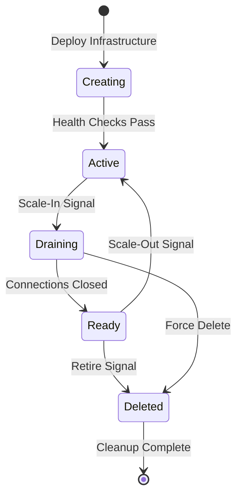

# Stamp Lifecycle Management

**Epic:** E2 - Ephemeral Scale Unit Architecture  
**Document:** Stamp State Machine and Operations  
**Status:** In Progress  

## State Machine



## State Definitions

### Creating
**Entry Point:** Infrastructure deployment initiated

**Characteristics:**
- Resource provisioning in progress
- Not yet accepting traffic
- Health checks running but not enforced

**Exit Conditions:**
- All infrastructure resources provisioned
- All health checks passing
- Security policies applied

**Timeout:** 30 minutes
- If timeout exceeded → Failed state

**Operations Allowed:**
- View deployment logs
- Cancel deployment (→ Deleted)

**Operations Blocked:**
- Route traffic
- Accept connections

### Active
**Entry Point:** Deployment successful, health checks pass

**Characteristics:**
- Fully operational
- Accepting traffic via Front Door
- Participating in load balancing

**Health Checks:**
- Kubernetes: `/healthz` on all nodes
- Application: `/health` endpoint
- Data: Cosmos DB latency < 10ms
- Integration: Service Bus connectivity

**Metrics Monitored:**
- CPU utilization (scale-out if > 70%)
- Memory utilization (scale-out if > 80%)
- Request latency p99 (scale-out if > 500ms)
- Active connections

**Operations Allowed:**
- All normal operations
- Deploy application updates
- Scale node pools
- View metrics and logs

**Operations Blocked:**
- Infrastructure changes (requires new stamp)

### Draining
**Entry Point:** Scale-in signal received

**Characteristics:**
- No new connections accepted
- Existing connections allowed to complete
- Gradual traffic reduction

**Drain Process:**
1. Remove from Front Door backend pool
2. Wait for active connections to close (max 10 min)
3. Wait for active inference jobs to complete (max 30 min)
4. Mark pods as unschedulable

**Timeout:** 40 minutes
- Active connections: 10 min
- Active jobs: 30 min

**Force Options:**
- `--force`: Immediate termination (risk: dropped connections)
- `--grace-period`: Override default timeouts

**Operations Allowed:**
- Monitor drain progress
- Force completion
- Cancel drain (→ Active)

**Operations Blocked:**
- New deployments
- Scale operations
- Configuration changes

### Ready (Standby)
**Entry Point:** Drain completed successfully

**Characteristics:**
- Warm infrastructure
- Not accepting traffic
- Ready to become Active within 2 minutes
- Minimal cost (scaled-down node pools)

**Standby Mode:**
- System pool: Minimum 3 nodes
- General pool: Scaled to 0 or minimum
- GPU pool: Scaled to 0

**Activation Time:**
- Cold start: 5-10 minutes
- Warm standby: 1-2 minutes

**Max Standby Duration:** 72 hours
- After 72 hours → Automatic retirement

**Operations Allowed:**
- Activate to Active state
- Retire to Deleted state
- View current state

**Operations Blocked:**
- Infrastructure modifications

### Deleted
**Entry Point:** Retirement completed or force delete

**Characteristics:**
- Infrastructure being destroyed
- Data persisted in shared services
- Connections terminated

**Deletion Process:**
1. Backup any local state
2. Remove from monitoring
3. Delete compute resources (AKS)
4. Delete integration resources (Service Bus)
5. Delete data resources (optionally retain)
6. Delete resource group

**Data Retention:**
- Cosmos DB: Retained (shared)
- Redis: Deleted
- PostgreSQL: Deleted (backup retained)
- Local storage: Deleted

**Operations Allowed:**
- View deletion logs
- Restore from backup (if applicable)

**Operations Blocked:**
- All runtime operations

## State Transitions

### Creating → Active

**Trigger:** All health checks pass

**Actions:**
```bash
# 1. Verify health
kubectl get nodes --all-namespaces
kubectl get pods -n kube-system

# 2. Run smoke tests
curl https://$STAMP_URL/health

# 3. Add to Front Door
az afd endpoint update \
  --endpoint-name $ENDPOINT \
  --profile-name $PROFILE \
  --resource-group $RG \
  --add backend-pool $STAMP_NAME

# 4. Update state
stampctl activate $STAMP_ID
```

**Validation:**
- Traffic flows to stamp within 30 seconds
- Health checks continue passing
- Metrics appear in dashboard

### Active → Draining

**Trigger:** Scale-in signal or manual drain command

**Actions:**
```bash
# 1. Cordon all nodes
kubectl cordon --all

# 2. Remove from Front Door
az afd endpoint update \
  --endpoint-name $ENDPOINT \
  --profile-name $PROFILE \
  --resource-group $RG \
  --remove backend-pool $STAMP_NAME

# 3. Wait for connections
# (automated via controller)

# 4. Update state
stampctl drain $STAMP_ID
```

**Validation:**
- No new requests
- Active connections decreasing
- Pod count decreasing

### Draining → Ready

**Trigger:** All connections closed and jobs completed

**Actions:**
```bash
# 1. Scale down node pools
az aks nodepool scale \
  --cluster-name $CLUSTER \
  --nodepool-name general \
  --node-count 0

# 2. Disable ingress
kubectl scale deployment ingress-nginx-controller --replicas=0

# 3. Update state
stampctl standby $STAMP_ID
```

**Validation:**
- 0 active connections
- Minimal running pods
- Infrastructure warm but idle

### Ready → Active

**Trigger:** Scale-out signal

**Actions:**
```bash
# 1. Scale up node pools
az aks nodepool scale \
  --cluster-name $CLUSTER \
  --nodepool-name general \
  --node-count 3

# 2. Enable ingress
kubectl scale deployment ingress-nginx-controller --replicas=2

# 3. Wait for pods ready
kubectl wait --for=condition=ready pod -l app=ingress-nginx

# 4. Add to Front Door
az afd endpoint update \
  --endpoint-name $ENDPOINT \
  --profile-name $PROFILE \
  --resource-group $RG \
  --add backend-pool $STAMP_NAME

# 5. Update state
stampctl activate $STAMP_ID
```

**Validation:**
- Node pools scaled up
- Pods running and ready
- Health checks passing
- Traffic flowing

### Ready → Deleted

**Trigger:** Retirement signal or max standby duration exceeded

**Actions:**
```bash
# 1. Backup local state (if any)
stampctl backup $STAMP_ID

# 2. Delete AKS cluster
az aks delete \
  --name $CLUSTER \
  --resource-group $RG \
  --yes

# 3. Delete resource group
az group delete \
  --name $RG \
  --yes

# 4. Update state
stampctl delete $STAMP_ID
```

**Validation:**
- All resources deleted
- No orphaned resources
- Cleanup logs archived

## Operations

### Deploy New Stamp

```bash
# Deploy infrastructure
stampctl deploy \
  --region westeurope \
  --stamp-id 003 \
  --template synaxis-stamp

# Wait for creation → active
stampctl wait --for=active synaxis-weu-003
```

### Drain Stamp

```bash
# Graceful drain
stampctl drain synaxis-weu-003

# Force drain (immediate)
stampctl drain synaxis-weu-003 --force

# Drain with custom timeout
stampctl drain synaxis-weu-003 --grace-period=60m
```

### Activate Standby

```bash
# Activate from standby
stampctl activate synaxis-weu-003

# Wait for active state
stampctl wait --for=active synaxis-weu-003
```

### Delete Stamp

```bash
# Graceful delete (drain first)
stampctl delete synaxis-weu-003

# Force delete (immediate termination)
stampctl delete synaxis-weu-003 --force
```

### List Stamps

```bash
# All stamps
stampctl list

# Filter by state
stampctl list --state=active
stampctl list --state=ready

# Filter by region
stampctl list --region=westeurope
```

### Get Stamp Status

```bash
# Detailed status
stampctl status synaxis-weu-003

# Health summary
stampctl health synaxis-weu-003

# Metrics
stampctl metrics synaxis-weu-003 --period=1h
```

## Automation

### Auto-Scale Controller

The auto-scale controller monitors metrics and manages stamp lifecycle:

```yaml
apiVersion: autoscaling.synaxis.io/v1
kind: StampAutoscaler
metadata:
  name: synaxis-autoscaler
spec:
  scaleOut:
    triggers:
      - metric: cpu_utilization
        threshold: 70
        duration: 5m
      - metric: memory_utilization
        threshold: 80
        duration: 5m
      - metric: request_latency_p99
        threshold: 500ms
        duration: 3m
    cooldown: 10m
    maxStamps: 10
  
  scaleIn:
    triggers:
      - metric: cpu_utilization
        threshold: 30
        duration: 15m
      - metric: active_connections
        threshold: 10
        duration: 10m
    cooldown: 30m
    minStamps: 2
  
  standby:
    maxAge: 72h
    scaleDown:
      generalPool: 0
      gpuPool: 0
```

### Health Controller

Monitors stamp health and initiates recovery:

```yaml
apiVersion: health.synaxis.io/v1
kind: StampHealthCheck
metadata:
  name: synaxis-health
spec:
  checks:
    - name: kubernetes
      interval: 10s
      timeout: 5s
      healthyThreshold: 2
      unhealthyThreshold: 3
    
    - name: application
      interval: 30s
      timeout: 10s
      endpoint: /health
      healthyThreshold: 2
      unhealthyThreshold: 3
    
    - name: data
      interval: 30s
      timeout: 5s
      checks:
        - cosmos_db_latency < 10ms
        - redis_response < 5ms
  
  recovery:
    enabled: true
    maxRetries: 3
    action: redeploy  # or: drain, alert
```

## Error Handling

### Creation Failure

If stamp fails to reach Active state:

1. Log all errors
2. Retry up to 3 times
3. If still failing → mark as Failed
4. Alert operations team
5. Optionally auto-delete after 1 hour

### Drain Failure

If stamp fails to drain within timeout:

1. Log stuck connections
2. Force terminate after grace period
3. Alert if connections lost
4. Mark as Ready (with warning)

### Activation Failure

If standby stamp fails to activate:

1. Retry activation
2. If fails 3 times → mark as Failed
3. Deploy new stamp instead
4. Alert operations team

## Metrics and Monitoring

### State Transition Metrics

| Metric | Description |
|--------|-------------|
| `stamp_state_duration` | Time spent in each state |
| `stamp_transitions_total` | Total number of transitions |
| `stamp_creation_duration` | Time from Creating → Active |
| `stamp_drain_duration` | Time from Active → Ready |
| `stamp_activation_duration` | Time from Ready → Active |

### Operational Metrics

| Metric | Description |
|--------|-------------|
| `active_stamps` | Number of stamps in Active state |
| `ready_stamps` | Number of stamps in Ready state |
| `creating_stamps` | Number of stamps being created |
| `draining_stamps` | Number of stamps being drained |
| `failed_stamps` | Number of stamps in Failed state |

### Alerting

| Alert | Condition | Action |
|-------|-----------|--------|
| `StampCreationFailed` | Creation timeout exceeded | Page on-call |
| `StampStuckDraining` | Draining > 45 minutes | Notify team |
| `StampActivationFailed` | Activation failed 3 times | Page on-call |
| `InsufficientActiveStamps` | Active stamps < 2 | Auto-scale + alert |
| `HighStandbyCount` | Ready stamps > 5 | Review capacity |

## References

- [stampctl CLI Reference](./stampctl-cli.md)
- [Auto-Scaling Policies](./auto-scaling.md)
- [Disaster Recovery](./disaster-recovery.md)
