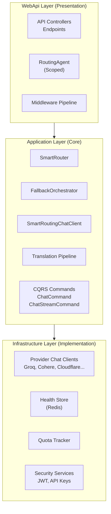
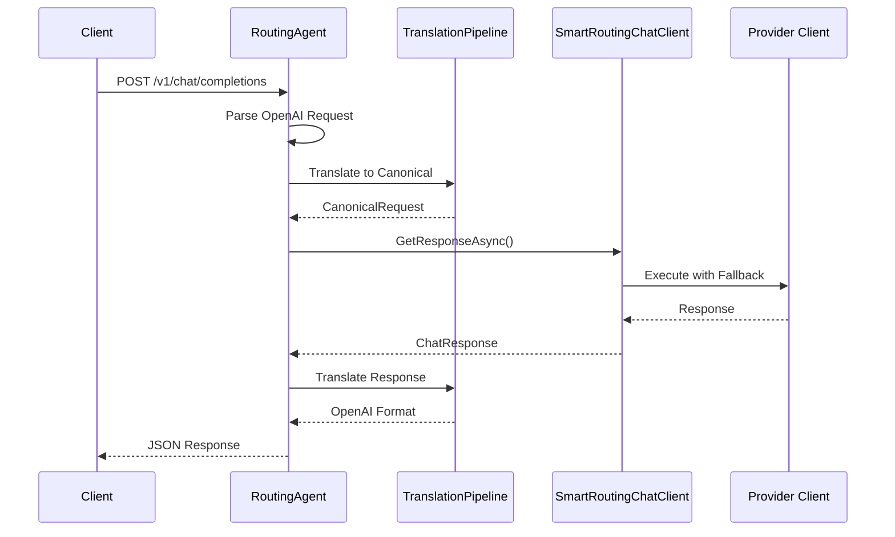
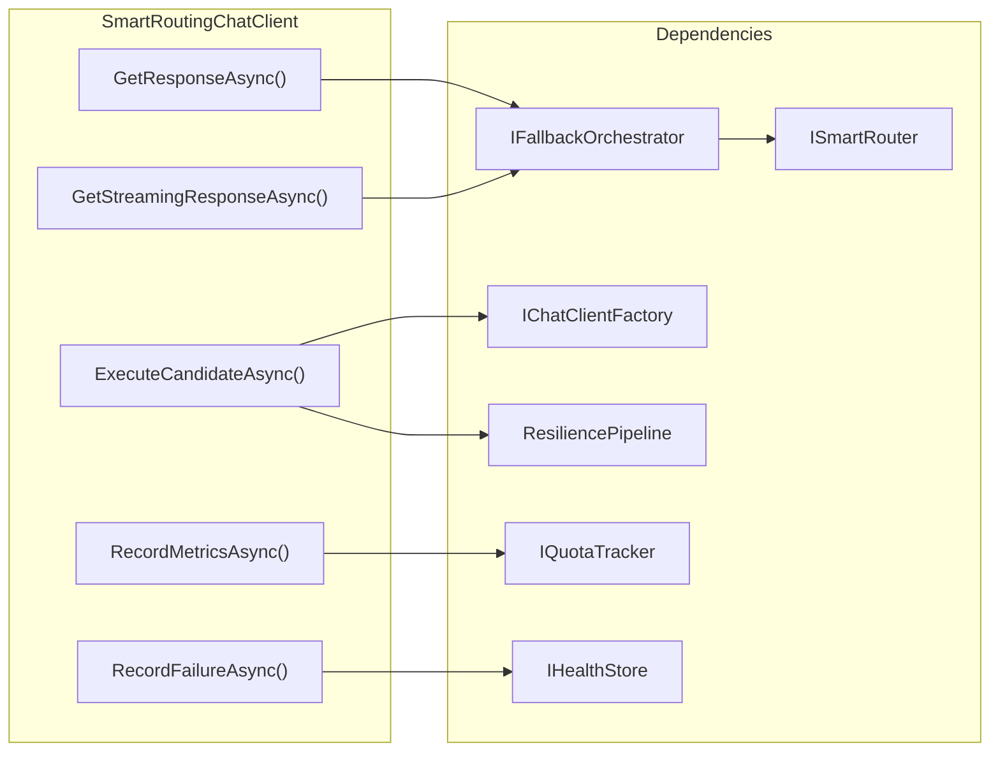
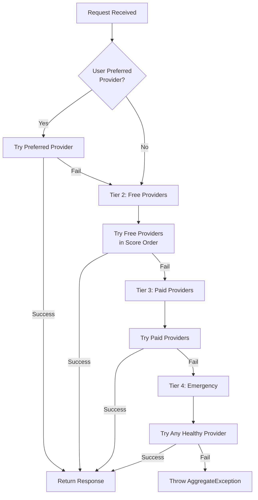
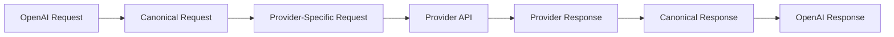
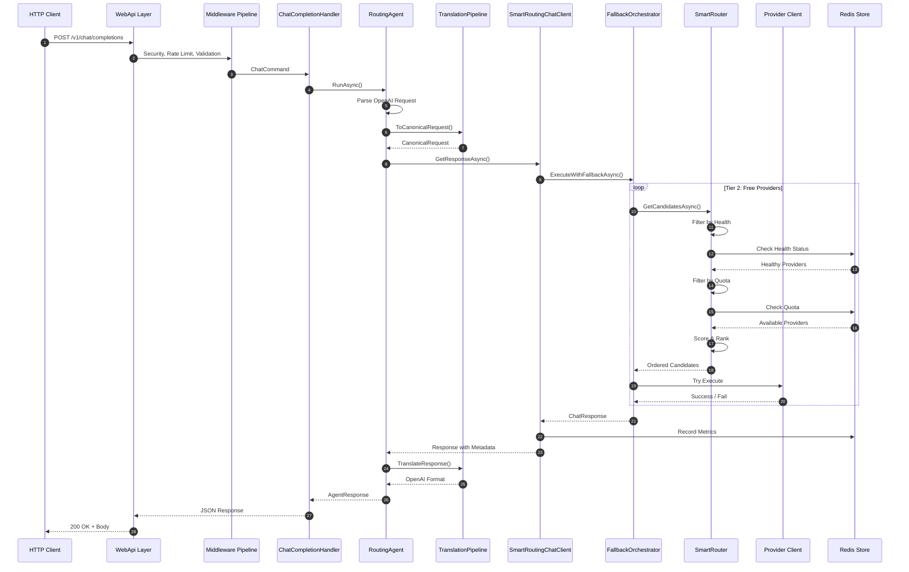
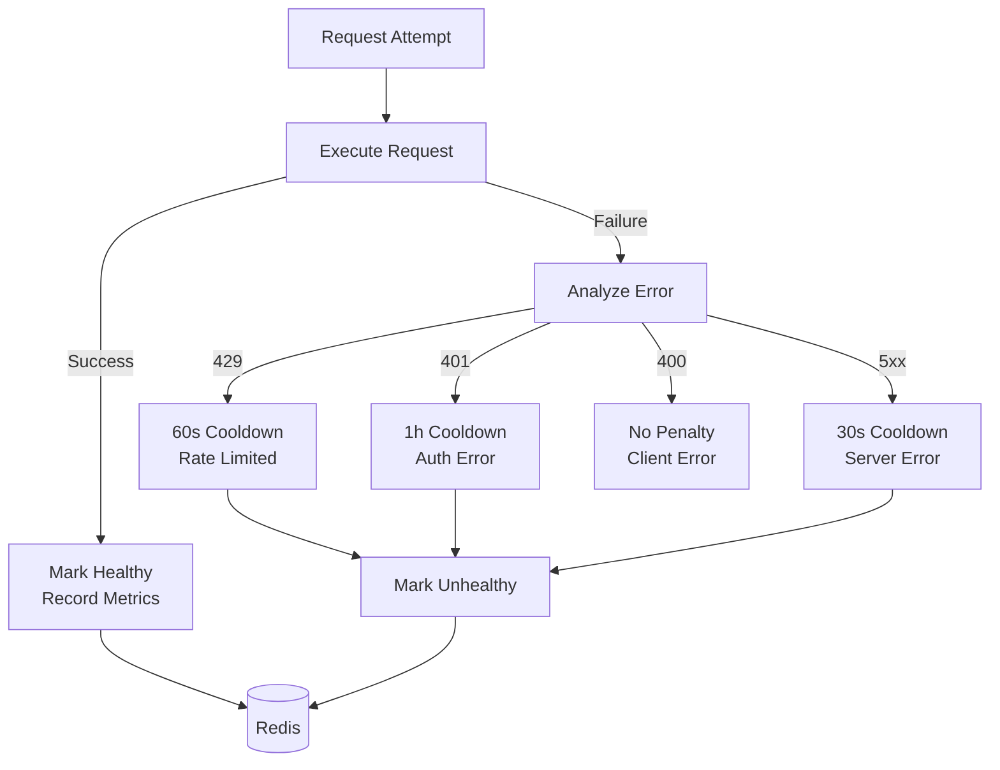
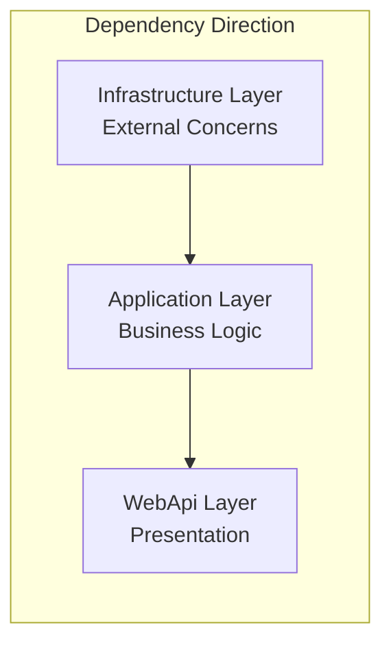

# Architecture

> **ULTRA MISER MODE™ Engineering**: Clean Architecture isn't just about separation of concerns—it's about separating your code from the burden of expensive infrastructure decisions. Every layer exists to maximize free tier utilization while maintaining enterprise-grade reliability.

Synaxis follows **Clean Architecture** principles to ensure separation of concerns, testability, and independence from frameworks. The architecture is designed specifically to support **ULTRA MISER MODE™**—intelligent routing across multiple free-tier AI providers with graceful failover.

---

## Three-Layer Architecture

The solution is organized into three distinct layers, each with clear responsibilities and dependencies flowing inward (Infrastructure → Application → WebApi).



---

## Layer Deep Dive

### 1. WebApi Layer (Presentation)

**Project**: `Synaxis.InferenceGateway.WebApi`

**Responsibilities**:
- Hosting the ASP.NET Core Web API
- Handling HTTP requests and responses
- OpenAI-compatible endpoint routing (`/v1/chat/completions`, `/v1/models`)
- Middleware pipeline execution (security, rate limiting, usage tracking)
- **RoutingAgent** - Scoped agent that orchestrates the translation → execution flow

**Key Components**:

| Component | Purpose |
|-----------|---------|
| `RoutingAgent` | Scoped AI agent that handles request parsing, translation, and execution |
| `ChatCompletionHandler` | Mediator handler for CQRS commands |
| Middleware Pipeline | Security headers, rate limiting, input validation, error handling |
| OpenAI Endpoints | OpenAI-compatible API surface |

**RoutingAgent Flow**:



---

### 2. Application Layer (Core)

**Project**: `Synaxis.InferenceGateway.Application`

**Responsibilities**:
- Business logic and domain rules
- **Intelligent routing decisions** (the "brain" of ULTRA MISER MODE™)
- Provider selection and failover orchestration
- Request/response translation abstractions
- CQRS command definitions

**Key Components**:

#### SmartRoutingChatClient

The core intelligence of the system. Implements `IChatClient` and provides:

- **Tiered Failover Routing**: 4-tier fallback strategy (preferred → free → paid → emergency)
- **Health-Aware Selection**: Only routes to healthy providers
- **Quota Tracking**: Respects provider rate limits
- **Resilience**: Polly-based retry and circuit breaker patterns



#### FallbackOrchestrator

Implements the **4-Tier Fallback Strategy** that embodies ULTRA MISER MODE™:

| Tier | Priority | Description | Use Case |
|------|----------|-------------|----------|
| **Tier 1** | Highest | User-preferred provider | Explicit provider selection |
| **Tier 2** | High | Free tier providers | ULTRA MISER MODE™ default |
| **Tier 3** | Medium | Paid providers | Fallback when free tiers exhausted |
| **Tier 4** | Emergency | Any healthy provider | Last resort, ignores quotas |



#### SmartRouter

Responsible for candidate selection based on:
- **Model Resolution**: Maps requested model to available providers
- **Health Filtering**: Excludes unhealthy providers
- **Quota Checking**: Excludes quota-exceeded providers
- **Score Calculation**: Ranks candidates by cost, latency, and reliability

#### Translation Pipeline

Abstracts provider-specific request/response formats:



#### CQRS with Mediator

Commands for chat operations:

```csharp
// Non-streaming command
public record ChatCommand(OpenAIRequest Request, IEnumerable<ChatMessage> Messages) 
    : IRequest<AgentResponse>;

// Streaming command  
public record ChatStreamCommand(OpenAIRequest Request, IEnumerable<ChatMessage> Messages) 
    : IStreamRequest<AgentResponseUpdate>;
```

Handlers delegate to the `RoutingAgent` for execution.

---

### 3. Infrastructure Layer (Implementation)

**Project**: `Synaxis.InferenceGateway.Infrastructure`

**Responsibilities**:
- Concrete implementations of external concerns
- Provider-specific API clients
- Security services (JWT, API keys, encryption)
- Health and quota storage (Redis)
- Identity providers (OAuth strategies)

**Provider Implementations**:

| Provider | Client Class | Type |
|----------|--------------|------|
| Groq | `GenericOpenAiChatClient` | OpenAI-compatible |
| Cohere | `CohereChatClient` | Native API |
| Cloudflare | `CloudflareChatClient` | Workers AI |
| OpenRouter | `GenericOpenAiChatClient` | OpenAI-compatible |
| Gemini | `GenericOpenAiChatClient` | OpenAI-compatible |
| Nvidia | `GenericOpenAiChatClient` | OpenAI-compatible |
| HuggingFace | `GenericOpenAiChatClient` | OpenAI-compatible |
| Pollinations | `PollinationsChatClient` | Native API |
| Antigravity | `AntigravityChatClient` | Custom OAuth |
| AI Horde | `AiHordeChatClient` | Distributed |

**Extension Pattern**:

Each provider registers via extension methods:

```csharp
services.AddGroqClient(configuration);
services.AddCohereClient(configuration);
services.AddCloudflareClient(configuration);
// ... etc
```

---

## Complete Request Flow



---

## ULTRA MISER MODE™ Architecture Philosophy

The architecture is purpose-built to support **ULTRA MISER MODE™**—maximizing free tier usage while maintaining reliability:

### Cost Optimization Design Decisions

1. **Tiered Routing Priority**: Free providers are always attempted before paid ones (Tier 2 before Tier 3)

2. **Health-Aware Selection**: Unhealthy providers are automatically excluded, preventing wasted requests on known-bad endpoints

3. **Quota Tracking**: Redis-backed quota tracking prevents hitting rate limits that could trigger paid tier penalties

4. **Intelligent Failover**: 4-tier fallback ensures requests succeed even when multiple free tiers are exhausted

5. **Circuit Breaker Pattern**: Providers that return 429 (Too Many Requests) or 5xx errors are temporarily excluded with appropriate cooldown periods

### Provider Health Management



### Resilience Configuration

| Error Type | Cooldown | Severity | Action |
|------------|----------|----------|--------|
| 429 Too Many Requests | 60s | Warning | Mark unhealthy, retry next provider |
| 401 Unauthorized | 1 hour | Critical | Mark unhealthy, alert admin |
| 5xx Server Error | 30s | Error | Mark unhealthy, retry next provider |
| 400/404 Client Error | None | Error | Don't penalize provider |

---

## Dependency Flow



**Key Principle**: Dependencies always point inward. The Application layer knows nothing about ASP.NET Core or HTTP. The WebApi layer knows nothing about provider APIs or Redis.

---

## Testing Architecture

The Clean Architecture enables comprehensive testing at each layer:

| Layer | Test Type | Count |
|-------|-----------|-------|
| WebApi | Integration Tests | 200+ |
| Application | Unit Tests | 300+ |
| Infrastructure | Integration Tests | 135+ |

Mock implementations of `IChatClient`, `IHealthStore`, and `IQuotaTracker` enable isolated testing of routing logic without external dependencies.

---

## Summary

Synaxis architecture embodies **ULTRA MISER MODE™** through:

1. **Clean Architecture**: Separation of concerns enables independent evolution
2. **Intelligent Routing**: 4-tier failover maximizes free tier utilization
3. **Health Awareness**: Proactive provider exclusion prevents wasted requests
4. **Resilience Patterns**: Circuit breakers and retries ensure reliability
5. **CQRS + Mediator**: Clean command handling with streaming support
6. **Translation Pipeline**: Provider-agnostic abstraction layer

The result: Enterprise-grade AI inference routing that treats paid tiers as a last resort, not a default.

> *"The best architecture is one that makes being cheap look like being smart."* — ULTRA MISER MODE™ Principle #7
