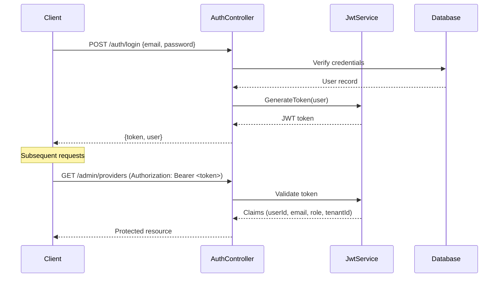
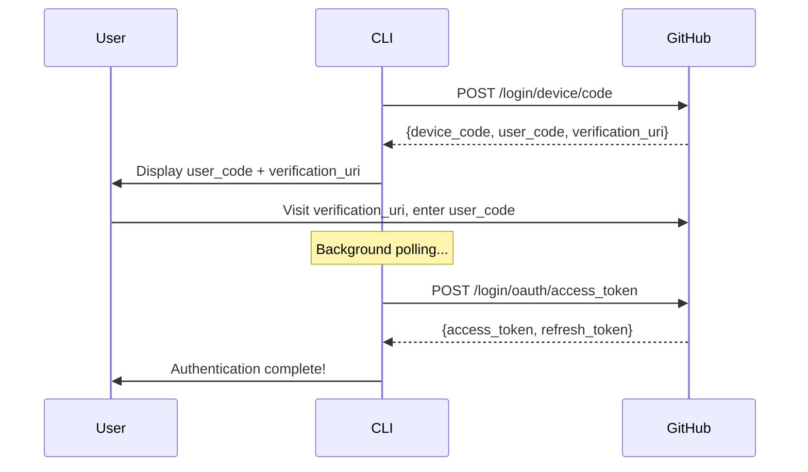
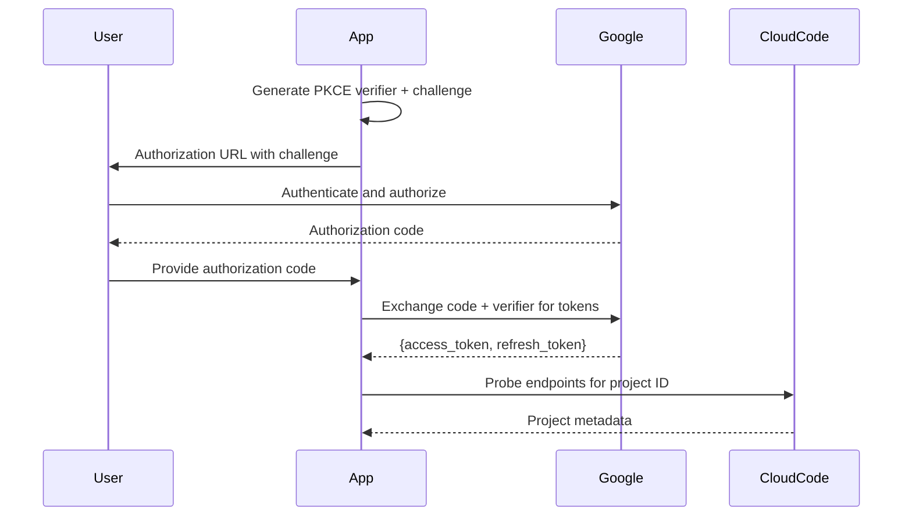

# Security Guide

> **ULTRA MISER MODE™ Security**: Why pay for enterprise security when you can implement it yourself for free? This guide covers how Synaxis keeps your tokens safe without requiring a security budget that rivals your AI spending.

Synaxis implements comprehensive security measures to protect your AI gateway while maintaining the **ULTRA MISER MODE™** philosophy—enterprise-grade security without enterprise-grade costs.

---

## Table of Contents

- [Authentication Methods](#authentication-methods)
  - [JWT Authentication](#jwt-authentication)
  - [OAuth Providers](#oauth-providers)
- [Authorization & Access Control](#authorization--access-control)
- [Rate Limiting](#rate-limiting)
- [Security Headers](#security-headers)
- [Security Best Practices](#security-best-practices)
- [Configuration](#configuration)

---

## Authentication Methods

Synaxis supports multiple authentication methods to accommodate different use cases—from local development to production deployments.

### JWT Authentication

JSON Web Tokens (JWT) are the primary authentication mechanism for the Synaxis API and Admin Web UI.

#### How JWT Works in Synaxis



#### JWT Token Structure

```csharp
// Token claims include:
{
  "sub": "user-guid",           // User ID
  "email": "user@example.com",  // User email
  "role": "Owner",              // User role
  "tenantId": "tenant-guid",    // Tenant ID
  "iss": "Synaxis",             // Issuer
  "aud": "Synaxis",             // Audience
  "exp": 1704067200             // Expiration (7 days)
}
```

#### JWT Configuration

Configure JWT in `appsettings.json`:

```json
{
  "Synaxis": {
    "InferenceGateway": {
      "JwtSecret": "your-256-bit-secret-key-here-minimum-32-chars",
      "JwtIssuer": "Synaxis",
      "JwtAudience": "Synaxis"
    }
  }
}
```

**Security Requirements**:
- Secret must be at least 32 characters (256 bits)
- Never use default or empty secrets in production
- Rotate secrets periodically
- Store secrets in environment variables or secret management systems

#### Local Authentication Endpoints

| Endpoint | Method | Description |
|----------|--------|-------------|
| `/auth/register` | POST | Register new user with email/password |
| `/auth/login` | POST | Authenticate and receive JWT token |
| `/auth/dev-login` | POST | Development-only auto-login (creates user if needed) |

**Example Login Request**:

```bash
curl -X POST http://localhost:8080/auth/login \
  -H "Content-Type: application/json" \
  -d '{
    "email": "admin@example.com",
    "password": "secure-password"
  }'
```

**Example Response**:

```json
{
  "token": "eyJhbGciOiJIUzI1NiIs...",
  "user": {
    "id": "550e8400-e29b-41d4-a716-446655440000",
    "email": "admin@example.com"
  }
}
```

---

### OAuth Providers

Synaxis supports OAuth 2.0 authentication through multiple identity providers, enabling users to authenticate with existing accounts.

#### Supported OAuth Providers

| Provider | Flow Type | Use Case |
|----------|-----------|----------|
| **GitHub** | Device Flow | CLI tools, headless environments |
| **Google** | PKCE + Authorization Code | Web applications, Antigravity integration |
| **Antigravity** | Custom OAuth | Google Cloud Code integration |

#### GitHub OAuth (Device Flow)

The GitHub device flow is ideal for CLI applications and environments without browser access.

**Flow Overview**:



**Implementation Details**:

```csharp
// GitHub device flow initiation
var result = await _gitHubAuthStrategy.InitiateFlowAsync(cancellationToken);
// Returns:
// {
//   Status = "Pending",
//   UserCode = "ABCD-1234",
//   VerificationUri = "https://github.com/login/device"
// }
```

**Scopes Requested**:
- `repo` - Repository access
- `read:org` - Organization read access
- `copilot` - GitHub Copilot access

#### Google OAuth (PKCE)

Google OAuth uses PKCE (Proof Key for Code Exchange) for secure authorization code flow, specifically designed for Antigravity provider integration.

**Flow Overview**:



**PKCE Implementation**:

```csharp
// Generate PKCE parameters
var verifier = GenerateCodeVerifier();      // 32 random bytes, base64url encoded
var challenge = GenerateCodeChallenge(verifier);  // SHA256(verifier), base64url encoded

// Authorization request includes:
// - code_challenge: challenge
// - code_challenge_method: S256
// - state: encoded(verifier + projectId)
```

**Scopes Requested**:
- `https://www.googleapis.com/auth/cloud-platform`
- `https://www.googleapis.com/auth/userinfo.email`
- `https://www.googleapis.com/auth/userinfo.profile`

#### Antigravity Authentication

Antigravity uses a custom OAuth implementation built on Google OAuth, specifically for Google Cloud Code integration.

**Features**:
- **Multi-account support**: Load balance across multiple Google accounts
- **Round-robin selection**: Distribute requests across available accounts
- **Automatic token refresh**: Refresh expired tokens automatically
- **Environment variable injection**: Support for `ANTIGRAVITY_REFRESH_TOKEN`

**Account Format**:

```bash
# Environment variable format
ANTIGRAVITY_REFRESH_TOKEN="refresh_token|project_id"
```

**Token Storage**:
- Accounts persisted to configured token store
- Supports file-based or custom token stores
- Automatic save on token refresh

---

## Authorization & Access Control

### Role-Based Access Control (RBAC)

Synaxis implements RBAC with the following roles:

| Role | Permissions |
|------|-------------|
| **Owner** | Full access to all resources, can manage users and settings |
| **Admin** | Can manage providers and view system status |
| **User** | Can make inference requests, view own usage |

### Tenant Isolation

Each user belongs to a tenant, ensuring complete data isolation:

```csharp
// JWT claims include tenantId
var claims = new List<Claim>
{
    new Claim("tenantId", user.TenantId.ToString()),
    new Claim("role", user.Role.ToString())
};
```

All database queries are scoped to the user's tenant:

```csharp
// Example: Providers are tenant-scoped
var providers = await _dbContext.Providers
    .Where(p => p.TenantId == currentUser.TenantId)
    .ToListAsync();
```

---

## Rate Limiting

Synaxis implements sliding window rate limiting to prevent abuse and ensure fair resource usage.

### Rate Limiting Configuration

**Default Limits**:
- **100 requests per minute** per IP address
- Window size: 1 minute
- Sliding window algorithm

### Rate Limit Headers

Every response includes rate limit information:

```http
HTTP/1.1 200 OK
X-RateLimit-Limit: 100
X-RateLimit-Remaining: 87
X-RateLimit-Reset: Mon, 02 Feb 2026 12:34:56 GMT
```

### Rate Limit Response

When limit exceeded:

```http
HTTP/1.1 429 Too Many Requests
X-RateLimit-Limit: 100
X-RateLimit-Remaining: 0
X-RateLimit-Reset: Mon, 02 Feb 2026 12:34:56 GMT

{
  "error": "Rate limit exceeded. Try again in 45 seconds."
}
```

### Implementation Details

```csharp
// Sliding window algorithm
var requestTimestamps = _cache.GetOrCreate(cacheKey, entry =>
{
    entry.AbsoluteExpirationRelativeToNow = TimeSpan.FromMinutes(1);
    return new List<DateTime>();
});

// Remove expired timestamps
requestTimestamps.RemoveAll(t => t < windowStart);

// Check limit
if (requestTimestamps.Count >= 100)
{
    context.Response.StatusCode = 429;
    return;
}

// Record request
requestTimestamps.Add(DateTime.UtcNow);
```

### IP Address Detection

Rate limiting supports proxied environments:

```csharp
// Check X-Forwarded-For header first
var forwardedFor = context.Request.Headers["X-Forwarded-For"].FirstOrDefault();
if (!string.IsNullOrEmpty(forwardedFor))
{
    return forwardedFor.Split(',')[0].Trim();
}

// Fallback to direct connection
return context.Connection.RemoteIpAddress?.ToString() ?? "unknown";
```

---

## Security Headers

Synaxis automatically adds security headers to all responses via `SecurityHeadersMiddleware`.

### Security Headers Applied

| Header | Value | Purpose |
|--------|-------|---------|
| `X-Content-Type-Options` | `nosniff` | Prevent MIME type sniffing |
| `X-Frame-Options` | `DENY` | Prevent clickjacking |
| `X-XSS-Protection` | `1; mode=block` | Enable XSS filter |
| `Referrer-Policy` | `strict-origin-when-cross-origin` | Control referrer information |
| `Permissions-Policy` | `geolocation=(), microphone=(), camera=()` | Disable sensitive APIs |
| `Strict-Transport-Security` | `max-age=31536000; includeSubDomains; preload` | Enforce HTTPS (production only) |
| `Content-Security-Policy` | See below | Prevent XSS and data injection |

### Content Security Policy

```http
Content-Security-Policy: default-src 'self'; 
  script-src 'self' 'unsafe-inline' 'unsafe-eval'; 
  style-src 'self' 'unsafe-inline'; 
  img-src 'self' data: https:; 
  font-src 'self' data:; 
  connect-src 'self'; 
  frame-ancestors 'none'; 
  base-uri 'self'; 
  form-action 'self';
```

### Development vs Production

In development mode:
- `Strict-Transport-Security` is disabled (no HTTPS requirement)
- More permissive CSP for hot reload

In production:
- All headers enabled
- HSTS with 1-year max-age

---

## Security Best Practices

### ULTRA MISER MODE™ Security Philosophy

> *"The best security is the kind that doesn't cost extra. Implement it once, use it forever, and sleep soundly knowing your free-tier AI gateway is locked down tighter than your wallet.*" — ULTRA MISER MODE™ Principle #23

### JWT Secret Management

**DO**:
- Use cryptographically secure random strings (32+ characters)
- Store secrets in environment variables
- Rotate secrets quarterly
- Use different secrets for different environments

**DON'T**:
- Commit secrets to version control
- Use default or example secrets in production
- Share secrets across multiple services
- Use short or predictable secrets

**Example Environment Setup**:

```bash
# .env file (never commit this!)
JWT_SECRET=$(openssl rand -base64 32)
```

### OAuth Security

**PKCE for Mobile/SPA**:
- Always use PKCE for public clients
- Generate unique verifier per authorization request
- Validate state parameter to prevent CSRF

**Token Storage**:
- Store tokens encrypted at rest
- Use secure, httpOnly cookies for web apps
- Never expose tokens in URLs or logs

**Token Refresh**:
- Implement automatic token refresh
- Handle refresh failures gracefully
- Revoke tokens on logout

### API Security

**Input Validation**:
- All inputs validated via `InputValidationMiddleware`
- Strict model binding with `[ApiController]`
- Sanitize user inputs to prevent injection

**Error Handling**:
- Generic error messages to clients
- Detailed logs on server only
- No stack traces in production responses

### Network Security

**HTTPS**:
- Always use HTTPS in production
- Enable HSTS with preload
- Use TLS 1.2 or higher

**CORS**:
- Configure strict CORS policies
- Only allow trusted origins
- Don't use `*` in production

### Database Security

**Connection Strings**:
- Use encrypted connections (SSL/TLS)
- Store credentials in environment variables
- Use connection string builders, not string concatenation

**Query Safety**:
- Use parameterized queries (Entity Framework)
- Never concatenate user input into SQL
- Enable query logging only in development

---

## Configuration

### Environment Variables

| Variable | Description | Required |
|----------|-------------|----------|
| `JWT_SECRET` | JWT signing secret (32+ chars) | Yes |
| `JWT_ISSUER` | JWT issuer claim | No (default: Synaxis) |
| `JWT_AUDIENCE` | JWT audience claim | No (default: Synaxis) |
| `ANTIGRAVITY_CLIENT_ID` | Google OAuth client ID | For Antigravity |
| `ANTIGRAVITY_CLIENT_SECRET` | Google OAuth client secret | For Antigravity |
| `ANTIGRAVITY_REFRESH_TOKEN` | Refresh token for headless auth | Optional |
| `GITHUB_CLIENT_ID` | GitHub OAuth app ID | For GitHub auth |

### Docker Compose Security

```yaml
services:
  webapi:
    environment:
      - JWT_SECRET=${JWT_SECRET}
      - ANTIGRAVITY_CLIENT_ID=${ANTIGRAVITY_CLIENT_ID}
      - ANTIGRAVITY_CLIENT_SECRET=${ANTIGRAVITY_CLIENT_SECRET}
    secrets:
      - jwt_secret
      - antigravity_creds

secrets:
  jwt_secret:
    file: ./secrets/jwt_secret.txt
  antigravity_creds:
    file: ./secrets/antigravity.json
```

### Production Checklist

- [ ] JWT secret is 32+ random characters
- [ ] HTTPS enabled with valid certificate
- [ ] HSTS headers enabled
- [ ] Rate limiting configured appropriately
- [ ] CORS restricted to known origins
- [ ] Database using encrypted connections
- [ ] Secrets stored in environment variables or vault
- [ ] Error responses don't leak sensitive information
- [ ] Logging configured but not exposing secrets
- [ ] Regular security updates applied

---

## Additional Resources

- [Architecture Overview](ARCHITECTURE.md) - Security in the Clean Architecture context
- [API Reference](API.md) - Authentication endpoints and usage
- [Configuration Guide](CONFIGURATION.md) - Provider-specific security settings
- [Deployment Guide](DEPLOYMENT.md) - Production security hardening

---

> **Remember**: In ULTRA MISER MODE™, security isn't an expensive add-on—it's a mindset. Implement it right the first time, and your free-tier empire will remain impenetrable without costing a single extra token.
