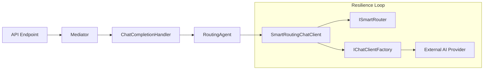

# ADR 001: Stream-Native CQRS Architecture with Microsoft Agent Framework

**Status:** Accepted
**Date:** 2026-01-26
**Context:**
The initial architecture of Synaxis relied on a service-chained model where the `RoutingAgent` (Singleton) manually managed scopes and dependencies, leading to hidden coupling and testing difficulties. The system required a more robust way to handle high-availability streaming token delivery, strictly typed pipelines, and better separation of concerns between domain logic (Agents), routing policy (Smart Router), and infrastructure (Resilience).

**Decision:**
We have adopted a **Stream-Native CQRS** architecture using `Mediator` (martinothamar) combined with the **Microsoft Agent Framework**.

## Key Architectural Components

### 1. CQRS Pipeline (Mediator)
We use `martinothamar/Mediator` (Source Generated) to handle the request pipeline.
*   **Commands:** `ChatCommand` (Unary) and `ChatStreamCommand` (Streaming) strictly define the intent.
*   **Handlers:** `ChatCompletionHandler` acts as the bridge, accepting commands and delegating execution to the Domain Core (`RoutingAgent`).
*   **Benefit:** Decouples the HTTP Transport (API) from the Domain Execution. Allows for future behavioral middleware (validation, rate limiting).

### 2. Domain Core (RoutingAgent)
The `RoutingAgent` is elevated to a **Scoped**, first-class citizen of the Microsoft Agent Framework.
*   **Responsibility:** Pure orchestration of the cognitive flow (Translation -> Execution -> Translation).
*   **Lifecycle:** Request-Scoped.
*   **DI:** Strict Constructor Injection (no `ServiceLocator` or `CreateScope`).

### 3. Resilience Core (SmartRoutingChatClient)
Infrastructure resilience is encapsulated within the `IChatClient` implementation, not the Agent.
*   **Responsibility:** Implements the **Provider Rotation Loop**.
    *   Consults `ISmartRouter` for candidate pools.
    *   Checks `IQuotaTracker` and `IHealthStore`.
    *   Rotates through providers on failure transparently to the Agent.
*   **Benefit:** The Agent "thinks" it's talking to a single reliable provider, while the infrastructure handles the chaos of distributed AI providers.

### 4. Infrastructure Isolation (IChatClientFactory)
Service Location is confined to a single infrastructure adapter (`ChatClientFactory`).
*   **Responsibility:** Resolves the concrete `IChatClient` for a specific provider key (e.g., "openai-east-us").
*   **Benefit:** Keeps the Application Core clean of DI container logic.

## Diagram

**Consequences:**
*   **Positive:** Testability is significantly improved. Streaming is typed and first-class. Dependencies are explicit.
*   **Negative:** Slight increase in complexity due to indirection (Mediator), but mitigated by compile-time source generation.

