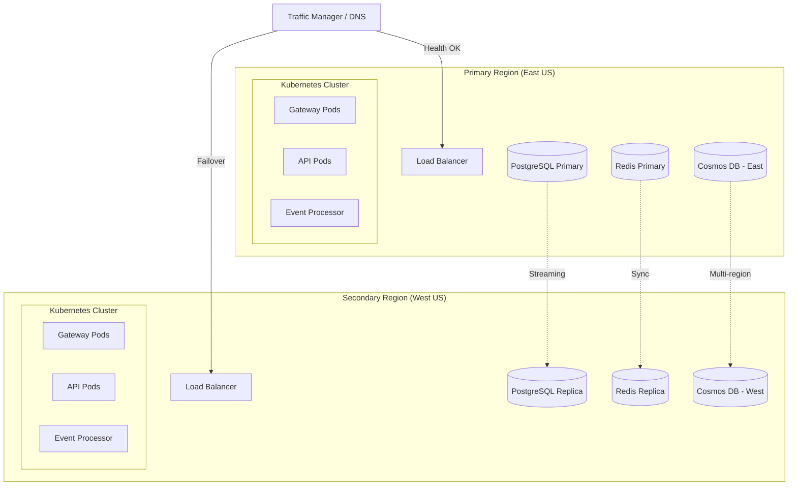

# Disaster Recovery Runbook - Synaxis-iosz

> **Version**: 1.0  
> **Last Updated**: 2026-03-04  
> **Owner**: Platform Engineering Team  
> **Review Cycle**: Quarterly

## Executive Summary

This runbook defines disaster recovery (DR) procedures for the Synaxis-iosz platform. It covers failure scenarios, recovery procedures, and validation steps to ensure business continuity with RTO < 1 hour and RPO < 15 minutes.

---

## Table of Contents

1. [DR Objectives](#dr-objectives)
2. [Architecture Overview](#architecture-overview)
3. [Database Failover Procedures](#database-failover-procedures)
4. [Service Failover Procedures](#service-failover-procedures)
5. [Regional Failover Procedures](#regional-failover-procedures)
6. [Backup & Restore Procedures](#backup--restore-procedures)
7. [DR Testing Schedule](#dr-testing-schedule)
8. [RTO/RPO Validation](#rtorpo-validation)
9. [Escalation Procedures](#escalation-procedures)
10. [Appendices](#appendices)

---

## DR Objectives

### Recovery Time Objective (RTO)
- **Target**: < 1 hour for full service recovery
- **Critical Path Services**: < 15 minutes
- **Non-Critical Services**: < 4 hours

### Recovery Point Objective (RPO)
- **Target**: < 15 minutes data loss maximum
- **Critical Data**: < 5 minutes (synchronous replication)
- **Event Store**: < 1 minute (continuous replication)

### Service Level Agreements

| Service | RTO Target | RPO Target | Priority |
|---------|-----------|-----------|----------|
| AI Gateway API | 15 min | 5 min | P0 |
| Authentication | 10 min | 0 min | P0 |
| Rate Limiting | 15 min | 5 min | P0 |
| Event Processing | 30 min | 1 min | P1 |
| Analytics | 60 min | 15 min | P2 |
| Admin Portal | 60 min | 15 min | P2 |

---

## Architecture Overview

### High-Availability Architecture



### Critical Components

| Component | Primary | Secondary | Replication | Failover |
|-----------|---------|-----------|-------------|----------|
| PostgreSQL | East US | West US | Streaming | Automated |
| Redis | East US | West US | Sentinel | Automated |
| Cosmos DB | East US | West US | Multi-write | Automatic |
| Kubernetes | East US | West US | N/A | DNS-based |
| Event Store | East US | West US | Async | Manual |

---

## Database Failover Procedures

### PostgreSQL Primary Failure

#### Detection
```bash
# Check PostgreSQL primary health
psql -h $PG_PRIMARY_HOST -U $PG_USER -c "SELECT 1;"

# Check replication lag
psql -h $PG_PRIMARY_HOST -U $PG_USER -c "
  SELECT 
    client_addr,
    state,
    pg_size_pretty(pg_wal_lsn_diff(sent_lsn, replay_lsn)) AS lag
  FROM pg_stat_replication;
"
```

#### Automated Failover (Patroni)
```bash
# Verify Patroni cluster status
patronictl -c /etc/patroni.yml list

# Check if failover occurred automatically
patronictl -c /etc/patroni.yml history

# If manual intervention needed
patronictl -c /etc/patroni.yml failover --leader $OLD_PRIMARY --candidate $REPLICA
```

#### Manual Failover (If Automation Fails)
```bash
# 1. Stop replication on replica
psql -h $PG_REPLICA_HOST -U postgres -c "SELECT pg_wal_replay_pause();"

# 2. Promote replica to primary
psql -h $PG_REPLICA_HOST -U postgres -c "SELECT pg_promote();"

# 3. Update application connection strings
kubectl set env deployment/synaxis-gateway \
  POSTGRES_HOST=$PG_REPLICA_HOST \
  POSTGRES_REPLICA_HOST=$PG_REPLICA_HOST

# 4. Restart pods to pick up new config
kubectl rollout restart deployment/synaxis-gateway
```

#### Validation
```bash
# Verify write capability on new primary
psql -h $PG_REPLICA_HOST -U $PG_USER -c "
  CREATE TABLE dr_test (id serial PRIMARY KEY, ts timestamp);
  INSERT INTO dr_test (ts) VALUES (NOW());
  SELECT * FROM dr_test;
  DROP TABLE dr_test;
"

# Check application connectivity
kubectl logs -l app=synaxis-gateway --tail=20 | grep -i "database"
```

### Cosmos DB Regional Failover

#### Detection
```bash
# Check Cosmos DB health
az cosmosdb show --name $COSMOS_ACCOUNT --resource-group $RG

# Check regional failover status
az cosmosdb failover-priority-change \
  --name $COSMOS_ACCOUNT \
  --resource-group $RG \
  --failover-policies "West US=0" "East US=1"
```

#### Automatic Failover
Cosmos DB automatic failover triggers when:
- Regional latency > 5 seconds for 60 seconds
- Regional availability < 99% for 5 minutes

#### Manual Regional Failover
```bash
# 1. Initiate manual failover
az cosmosdb failover-priority-change \
  --name $COSMOS_ACCOUNT \
  --resource-group $COSMOS_RG \
  --failover-policies "West US=0" "East US=1"

# 2. Monitor failover progress
watch -n 5 "az cosmosdb show --name $COSMOS_ACCOUNT --resource-group $COSMOS_RG --query 'locations[*].{name:name,provisioningState:provisioningState}'"

# 3. Verify application connectivity
curl -s $API_ENDPOINT/health | jq '.dependencies.cosmosDb'
```

#### Validation
```bash
# Test write operations in new region
az cosmosdb sql container throughput show \
  --account-name $COSMOS_ACCOUNT \
  --database-name synaxis \
  --container-name events \
  --resource-group $COSMOS_RG

# Verify data consistency
az cosmosdb sql query \
  --account-name $COSMOS_ACCOUNT \
  --database-name synaxis \
  --query "SELECT COUNT(1) FROM c WHERE c._ts > $(date -d '5 minutes ago' +%s)"
```

### Redis Cache Failure

#### Detection
```bash
# Check Redis Sentinel status
redis-cli -h $REDIS_SENTINEL_HOST -p 26379 SENTINEL get-master-addr-by-name mymaster

# Check cluster health
redis-cli -h $REDIS_HOST -p 6379 CLUSTER INFO
```

#### Failover Process
```bash
# 1. Check current master
redis-cli -h $REDIS_SENTINEL_HOST -p 26379 SENTINEL masters

# 2. Force failover if needed
redis-cli -h $REDIS_SENTINEL_HOST -p 26379 SENTINEL failover mymaster

# 3. Verify new master
redis-cli -h $REDIS_NEW_MASTER INFO replication | grep role

# 4. Update application config (if needed)
kubectl set env deployment/synaxis-gateway REDIS_HOST=$REDIS_NEW_MASTER
```

#### Validation
```bash
# Test write/read operations
redis-cli -h $REDIS_NEW_MASTER SET dr:test "$(date)"
redis-cli -h $REDIS_NEW_MASTER GET dr:test

# Check cache hit rate
redis-cli -h $REDIS_NEW_MASTER INFO stats | grep keyspace
```

### Point-in-Time Recovery (PITR)

#### PostgreSQL PITR
```bash
# 1. Stop application writes
kubectl scale deployment/synaxis-gateway --replicas=0

# 2. Identify recovery target time
RECOVERY_TIME="2026-03-04 14:30:00 UTC"

# 3. Restore from WAL archive
# On PostgreSQL replica server
systemctl stop patroni

# 4. Create recovery signal
cat > /var/lib/postgresql/data/recovery.signal << EOF
restore_command = 'cp /wal_archive/%f %p'
recovery_target_time = '$RECOVERY_TIME'
recovery_target_action = 'promote'
EOF

# 5. Start PostgreSQL in recovery mode
pg_ctlcluster 15 main start

# 6. Monitor recovery progress
tail -f /var/log/postgresql/postgresql-15-main.log | grep -i recovery

# 7. Once promoted, restart application
kubectl scale deployment/synaxis-gateway --replicas=3
```

#### Cosmos DB PITR
```bash
# 1. Create restore request
RESTORE_TIME="2026-03-04T14:30:00Z"

az cosmosdb restore \
  --target-database-account-name synaxis-restored \
  --account-name $COSMOS_ACCOUNT \
  --resource-group $COSMOS_RG \
  --restore-timestamp $RESTORE_TIME \
  --location "East US"

# 2. Monitor restore progress
az cosmosdb show --name synaxis-restored --resource-group $COSMOS_RG

# 3. Switch application to restored account
kubectl set env deployment/synaxis-gateway \
  COSMOS_ENDPOINT=$(az cosmosdb show --name synaxis-restored --query documentEndpoint -o tsv)
```

---

## Service Failover Procedures

### Kubernetes Node Failure

#### Detection
```bash
# Check node status
kubectl get nodes -o wide

# Check for NotReady nodes
kubectl get nodes | grep -v Ready

# Check node conditions
kubectl describe node $FAILED_NODE | grep -A 10 Conditions
```

#### Automated Recovery
Kubernetes automatically:
1. Detects node failure via heartbeats (default 40s timeout)
2. Evicts pods after 5 minutes of unreachable status
3. Reschedules pods to healthy nodes

#### Manual Intervention (If Pods Stuck)
```bash
# 1. Force delete stuck pods
kubectl delete pod $STUCK_POD --force --grace-period=0

# 2. Cordon failed node
kubectl cordon $FAILED_NODE

# 3. Drain remaining workloads
kubectl drain $FAILED_NODE --ignore-daemonsets --delete-emptydir-data

# 4. Verify pod rescheduling
kubectl get pods -o wide | grep synaxis

# 5. Verify service availability
kubectl get endpoints synaxis-gateway
```

### Pod Eviction and Rescheduling

#### Detection
```bash
# Check for evicted pods
kubectl get pods --all-namespaces | grep Evicted

# Check pod disruption budgets
kubectl get pdb -n synaxis

# Check resource quotas
kubectl describe resourcequota -n synaxis
```

#### Recovery
```bash
# 1. Identify eviction cause
kubectl describe pod $EVICTED_POD | grep -A 5 "Events:"

# 2. Clean up evicted pods
kubectl get pods --all-namespaces | grep Evicted | awk '{print $2 " --namespace=" $1}' | xargs -L1 kubectl delete pod

# 3. Scale up if resource constrained
kubectl scale deployment/synaxis-gateway --replicas=5

# 4. Verify pod distribution
kubectl get pods -o wide -l app=synaxis-gateway
```

### Service Mesh Circuit Breaker

#### Configuration (Istio)
```yaml
apiVersion: networking.istio.io/v1beta1
kind: DestinationRule
metadata:
  name: synaxis-gateway-dr
  namespace: synaxis
spec:
  host: synaxis-gateway
  trafficPolicy:
    connectionPool:
      tcp:
        maxConnections: 100
      http:
        http1MaxPendingRequests: 50
        maxRequestsPerConnection: 10
    outlierDetection:
      consecutive5xxErrors: 5
      interval: 30s
      baseEjectionTime: 30s
      maxEjectionPercent: 50
```

#### Detection
```bash
# Check circuit breaker status
istioctl proxy-config cluster $POD_NAME -n synaxis | grep -i outlier

# Check ejected endpoints
istioctl proxy-config endpoints $POD_NAME -n synaxis | grep -i unhealthy

# View circuit breaker metrics
kubectl exec $POD_NAME -c istio-proxy -- curl localhost:15090/stats/prometheus | grep outlier
```

#### Recovery
```bash
# 1. Check upstream health
kubectl get pods -l app=synaxis-gateway -o jsonpath='{range .items[*]}{.metadata.name}{"\t"}{.status.phase}{"\n"}{end}'

# 2. Restart unhealthy pods
kubectl delete pod $UNHEALTHY_POD

# 3. Verify circuit breaker clears
istioctl proxy-config endpoints $POD_NAME -n synaxis | grep synaxis-gateway

# 4. Adjust thresholds if needed
kubectl apply -f dr/destination-rule-adjusted.yaml
```

### Load Balancer Failover

#### Azure Load Balancer
```bash
# Check LB health probes
az network lb probe list --lb-name $LB_NAME --resource-group $RG

# Check backend pool health
az network lb address-pool show \
  --lb-name $LB_NAME \
  --name $POOL_NAME \
  --resource-group $RG \
  --query backendIPConfigurations

# Force failover to secondary region
az network traffic-manager endpoint update \
  --name primary \
  --profile-name $TM_PROFILE \
  --resource-group $RG \
  --type azureEndpoints \
  --endpoint-status Disabled
```

#### Validation
```bash
# Test from multiple locations
curl -s -o /dev/null -w "%{http_code}" https://$LB_IP/health

# Check traffic distribution
az monitor metrics list \
  --resource $LB_ID \
  --metric ByteCount \
  --interval PT1M
```

---

## Regional Failover Procedures

### Complete Region Failure Simulation

#### Pre-Failover Checklist
- [ ] Secondary region has capacity for full traffic
- [ ] Data replication lag < 1 minute
- [ ] DNS TTL temporarily lowered (300s)
- [ ] Monitoring alerts configured
- [ ] Stakeholders notified

#### Failover Execution
```bash
#!/bin/bash
# regional-failover.sh

PRIMARY_REGION="eastus"
SECONDARY_REGION="westus"
FAILOVER_TIME=$(date -u +"%Y-%m-%dT%H:%M:%SZ")

echo "=== Starting Regional Failover at $FAILOVER_TIME ==="

# 1. Update Traffic Manager
echo "1. Disabling primary region in Traffic Manager..."
az network traffic-manager endpoint update \
  --name $PRIMARY_REGION \
  --profile-name synaxis-tm \
  --resource-group synaxis-global \
  --type azureEndpoints \
  --endpoint-status Disabled

# 2. Promote PostgreSQL replica
echo "2. Promoting PostgreSQL replica in $SECONDARY_REGION..."
az postgres flexible-server replica promote \
  --name synaxis-pg-$SECONDARY_REGION \
  --resource-group synaxis-$SECONDARY_REGION \
  --promote-mode forced

# 3. Update Redis to primary mode
echo "3. Promoting Redis to primary in $SECONDARY_REGION..."
redis-cli -h synaxis-redis-$SECONDARY_REGION.redis.cache.windows.net \
  -p 6380 -a $REDIS_PASSWORD \
  CONFIG SET slave-read-only no

# 4. Scale up secondary region
echo "4. Scaling up secondary region capacity..."
kubectl config use-context synaxis-$SECONDARY_REGION
kubectl scale deployment/synaxis-gateway --replicas=10

# 5. Verify failover
echo "5. Verifying failover..."
sleep 30
curl -s https://api.synaxis.io/health | jq '.status'

echo "=== Regional Failover Complete ==="
echo "Failover Duration: $(($(date +%s) - $(date -d $FAILOVER_TIME +%s))) seconds"
```

#### Validation
```bash
# Verify all services healthy
for endpoint in /health /ready /metrics; do
  STATUS=$(curl -s -o /dev/null -w "%{http_code}" https://api.synaxis.io$endpoint)
  echo "$endpoint: $STATUS"
done

# Check data consistency
psql -h $PG_HOST -c "SELECT COUNT(*) FROM events WHERE created_at > NOW() - INTERVAL '5 minutes';"

# Verify traffic routing
dig +short api.synaxis.io
```

### DNS Failover

#### Traffic Manager Configuration
```bash
# Check current routing
az network traffic-manager profile show \
  --name synaxis-tm \
  --resource-group synaxis-global

# View endpoint priorities
az network traffic-manager endpoint list \
  --profile-name synaxis-tm \
  --resource-group synaxis-global
```

#### Emergency DNS Update
```bash
# Lower TTL for faster propagation
az network traffic-manager profile update \
  --name synaxis-tm \
  --resource-group synaxis-global \
  --ttl 30

# Switch routing method to failover
az network traffic-manager profile update \
  --name synaxis-tm \
  --resource-group synaxis-global \
  --routing-method Failover

# Verify DNS propagation
for dns in 8.8.8.8 1.1.1.1 9.9.9.9; do
  echo "=== $dns ==="
  dig @$dns +short api.synaxis.io
done
```

### Data Replication Verification

#### PostgreSQL Replication Check
```bash
# Check replication lag on secondary
psql -h $PG_SECONDARY -c "
  SELECT 
    extract(epoch from (now() - pg_last_xact_replay_timestamp())) as lag_seconds,
    pg_is_in_recovery() as is_replica;
"

# Verify write-ahead log shipping
psql -h $PG_PRIMARY -c "
  SELECT 
    client_addr,
    state,
    sent_lsn,
    replay_lsn,
    pg_wal_lsn_diff(sent_lsn, replay_lsn) as bytes_lag
  FROM pg_stat_replication;
"
```

#### Cosmos DB Replication Check
```bash
# Check regional replication status
az cosmosdb show --name $COSMOS_ACCOUNT --query locations

# Verify data consistency across regions
az cosmosdb sql query \
  --account-name $COSMOS_ACCOUNT \
  --database-name synaxis \
  --container-name events \
  --query "SELECT VALUE COUNT(1) FROM c"
```

### RTO Validation

```bash
#!/bin/bash
# measure-rto.sh

START_TIME=$(date +%s.%N)
echo "Starting DR test at $(date -Iseconds)"

# Trigger failure simulation
curl -X POST $SIMULATOR_ENDPOINT/fail-region \
  -H "Authorization: Bearer $TOKEN" \
  -d '{"region": "eastus", "duration": 300}'

# Wait for service recovery
until curl -s -f https://api.synaxis.io/health; do
  sleep 1
done

END_TIME=$(date +%s.%N)
RTO=$(echo "$END_TIME - $START_TIME" | bc)

echo "Service recovered at $(date -Iseconds)"
echo "Measured RTO: ${RTO}s"

# Validate against target
if (( $(echo "$RTO < 3600" | bc -l) )); then
  echo "RTO VALID: $RTO < 3600 seconds"
else
  echo "RTO VIOLATION: $RTO >= 3600 seconds"
fi
```

---

## Backup & Restore Procedures

### Database Backup Verification

#### Automated Backup Testing
```bash
#!/bin/bash
# verify-backups.sh

verify_postgres_backup() {
  LATEST_BACKUP=$(az storage blob list \
    --container-name postgres-backups \
    --account-name $STORAGE_ACCOUNT \
    --query "sort_by([*],&properties.lastModified)[-1].name" -o tsv)
  
  # Download and verify backup integrity
  az storage blob download \
    --container-name postgres-backups \
    --name $LATEST_BACKUP \
    --file /tmp/verify.backup \
    --account-name $STORAGE_ACCOUNT
  
  # Test restore to temp instance
  pg_restore --list /tmp/verify.backup > /dev/null && echo "Backup integrity: OK" || echo "Backup integrity: FAILED"
  
  # Check backup age
  BACKUP_AGE_HOURS=$(( ($(date +%s) - $(date -d $(az storage blob show \
    --container-name postgres-backups \
    --name $LATEST_BACKUP \
    --account-name $STORAGE_ACCOUNT \
    --query properties.lastModified -o tsv) +%s)) / 3600 ))
  
  echo "Latest backup age: ${BACKUP_AGE_HOURS}h"
}

verify_cosmos_backup() {
  az cosmosdb restorable-database-account list \
    --location eastus \
    --query "[?name=='$COSMOS_ACCOUNT'].{restoreTime:restorableLocations[0].oldestRestorableTime}"
}

# Run verifications
verify_postgres_backup
verify_cosmos_backup
```

### File Storage Recovery

#### Azure Blob Storage Recovery
```bash
# List available restore points
az storage blob list \
  --container-name synaxis-assets \
  --account-name $STORAGE_ACCOUNT \
  --include deleted \
  --query "[?deleted].{name:name,deletedTime:properties.deletedTime}"

# Restore soft-deleted blobs
az storage blob undelete \
  --container-name synaxis-assets \
  --name $BLOB_NAME \
  --account-name $STORAGE_ACCOUNT

# Point-in-time restore (if enabled)
az storage account blob-service-properties update \
  --account-name $STORAGE_ACCOUNT \
  --enable-change-feed \
  --enable-restore-policy \
  --restore-days 7
```

### Configuration Backup Restore

#### Kubernetes ConfigMap/Secret Restore
```bash
# Backup current configuration
kubectl get configmap synaxis-config -o yaml > /tmp/config-backup.yaml
kubectl get secret synaxis-secrets -o yaml > /tmp/secrets-backup.yaml

# Restore from backup
kubectl apply -f /tmp/config-backup.yaml
kubectl apply -f /tmp/secrets-backup.yaml

# Restart deployments to pick up config
kubectl rollout restart deployment/synaxis-gateway
```

#### Azure App Configuration Restore
```bash
# Export current configuration
az appconfig kv export \
  --name synaxis-config \
  --destination file \
  --path /tmp/config-backup.json \
  --format json

# Restore from backup
az appconfig kv import \
  --name synaxis-config \
  --source file \
  --path /tmp/config-backup.json \
  --format json \
  --separator :
```

### Event Store Recovery

#### Event Sourcing Replay
```bash
# 1. Identify event store checkpoint
LAST_CHECKPOINT=$(az cosmosdb sql query \
  --account-name $COSMOS_ACCOUNT \
  --database-name synaxis \
  --container-name checkpoints \
  --query "SELECT TOP 1 c.sequenceNumber FROM c ORDER BY c.sequenceNumber DESC" \
  --output tsv)

# 2. Replay events from checkpoint
cat > /tmp/replay-events.sql << EOF
SELECT * FROM events 
WHERE sequence_number > $LAST_CHECKPOINT 
ORDER BY sequence_number ASC;
EOF

# 3. Execute replay via application API
curl -X POST https://api.synaxis.io/admin/replay-events \
  -H "Authorization: Bearer $ADMIN_TOKEN" \
  -H "Content-Type: application/json" \
  -d "{\"fromSequence\": $LAST_CHECKPOINT, \"batchSize\": 1000}"

# 4. Monitor replay progress
watch -n 5 'curl -s https://api.synaxis.io/admin/replay-status | jq'
```

---

## DR Testing Schedule

### Testing Calendar

| Test Type | Frequency | Duration | Scope |
|-----------|-----------|----------|-------|
| Component Failover | Weekly | 30 min | Single service |
| Database Failover | Bi-weekly | 1 hour | PostgreSQL/Redis |
| Regional Failover | Monthly | 2 hours | Full region |
| Backup Restoration | Monthly | 3 hours | Data validation |
| Chaos Engineering | Quarterly | 4 hours | Random failures |
| Full DR Drill | Quarterly | 8 hours | End-to-end |

### Weekly Component Test
```bash
#!/bin/bash
# weekly-component-test.sh

TEST_DATE=$(date +%Y%m%d)
LOG_FILE="/var/log/dr-tests/weekly-$TEST_DATE.log"

echo "=== Weekly DR Test - $TEST_DATE ===" | tee $LOG_FILE

# Test 1: Pod failure and recovery
echo "Test 1: Pod failure simulation..." | tee -a $LOG_FILE
kubectl delete pod -l app=synaxis-gateway --force --grace-period=0
sleep 30
READY_PODS=$(kubectl get pods -l app=synaxis-gateway --field-selector=status.phase=Running | wc -l)
[ $READY_PODS -ge 2 ] && echo "PASS: Pods recovered" || echo "FAIL: Pods not recovered"

# Test 2: Circuit breaker activation
echo "Test 2: Circuit breaker test..." | tee -a $LOG_FILE
# Inject faults via chaos mesh
kubectl apply -f tests/chaos/network-delay.yaml
sleep 60
# Verify circuit breaker metrics
curl -s $METRICS_ENDPOINT | grep circuit_breaker
# Clean up
kubectl delete -f tests/chaos/network-delay.yaml

# Test 3: Health check validation
echo "Test 3: Health check validation..." | tee -a $LOG_FILE
curl -s https://api.synaxis.io/health | jq '.'

echo "=== Weekly Test Complete ===" | tee -a $LOG_FILE
```

### Monthly Regional Failover Test
```bash
#!/bin/bash
# monthly-regional-test.sh

NOTIFY_CHANNEL="#platform-alerts"
TEST_ID=$(uuidgen)
START_TIME=$(date -Iseconds)

echo "Starting Monthly Regional Failover Test - $TEST_ID"

# Notify team
curl -X POST $SLACK_WEBHOOK \
  -H 'Content-Type: application/json' \
  -d "{\"text\":\"🧪 Starting DR Test $TEST_ID at $START_TIME\"}"

# Execute controlled failover
./regional-failover.sh --test-mode --target-region=westus

# Run validation suite
cd tests/dr-validation
pytest --region=westus --test-id=$TEST_ID

# Collect metrics
RTO=$(cat /tmp/dr-test-$TEST_ID.rto)
RPO=$(cat /tmp/dr-test-$TEST_ID.rpo)

# Generate report
cat > /tmp/dr-report-$TEST_ID.md << EOF
# DR Test Report - $TEST_ID
- Date: $START_TIME
- RTO: ${RTO}s (Target: <3600s)
- RPO: ${RPO}s (Target: <900s)
- Status: $(if (( $(echo "$RTO < 3600" | bc -l) && $(echo "$RPO < 900" | bc -l) )); then echo "PASS"; else echo "FAIL"; fi)
EOF

# Notify completion
curl -X POST $SLACK_WEBHOOK \
  -H 'Content-Type: application/json' \
  -d "{\"text\":\"✅ DR Test $TEST_ID Complete\\nRTO: ${RTO}s | RPO: ${RPO}s\"}"
```

---

## RTO/RPO Validation

### Measurement Methodology

#### RTO Measurement
```csharp
public class DRTestMetrics
{
    public DateTime FailureInjectionTime { get; set; }
    public DateTime ServiceRecoveryTime { get; set; }
    public DateTime FullRecoveryTime { get; set; }
    
    public TimeSpan CalculateRTO()
    {
        return FullRecoveryTime - FailureInjectionTime;
    }
    
    public bool IsRTOTargetMet(TimeSpan target)
    {
        return CalculateRTO() < target;
    }
}

// Usage in test
[Fact]
public async Task RegionalFailover_MeetsRTOTarget()
{
    var metrics = new DRTestMetrics
    {
        FailureInjectionTime = DateTime.UtcNow
    };
    
    // Inject failure
    await _chaosEngine.InjectRegionalFailure("eastus");
    
    // Wait for recovery
    await WaitForServiceRecoveryAsync(timeout: TimeSpan.FromHours(1));
    
    metrics.FullRecoveryTime = DateTime.UtcNow;
    
    // Assert
    metrics.CalculateRTO().Should().BeLessThan(TimeSpan.FromHours(1));
}
```

#### RPO Measurement
```sql
-- Measure data loss window
WITH last_sync AS (
  SELECT MAX(sequence_number) as max_seq
  FROM events
  WHERE region = 'eastus'
),
replica_sync AS (
  SELECT MAX(sequence_number) as max_seq
  FROM events
  WHERE region = 'westus'
)
SELECT 
  l.max_seq - r.max_seq as events_lost,
  (l.max_seq - r.max_seq) * 100.0 / l.max_seq as percent_lost
FROM last_sync l, replica_sync r;
```

### Automated Validation

```yaml
# dr-validation-tests.yaml
apiVersion: batch/v1
kind: Job
metadata:
  name: dr-validation-test
spec:
  template:
    spec:
      containers:
      - name: validator
        image: synaxis/dr-validator:latest
        env:
        - name: TEST_TYPE
          value: "regional_failover"
        - name: TARGET_RTO_SECONDS
          value: "3600"
        - name: TARGET_RPO_SECONDS
          value: "900"
        command:
        - /bin/sh
        - -c
        - |
          dotnet test Synaxis.DR.Tests.dll \
            --filter "Category=DisasterRecovery" \
            --logger "trx;LogFileName=/results/dr-test-results.trx"
      restartPolicy: Never
  backoffLimit: 0
```

---

## Escalation Procedures

### Severity Levels

| Level | Criteria | Response Time | Escalation |
|-------|----------|---------------|------------|
| SEV-1 | Complete service outage | 5 min | On-call + Engineering Lead |
| SEV-2 | Major functionality impaired | 15 min | On-call |
| SEV-3 | Partial degradation | 30 min | On-call |
| SEV-4 | Minor issues | 4 hours | Next business day |

### Escalation Matrix

| Time Elapsed | Action | Contact |
|--------------|--------|---------|
| 0-5 min | Initial response | On-call Engineer |
| 5-15 min | Assess severity | On-call + Lead |
| 15-30 min | Engage DR team | Platform Team |
| 30-60 min | Executive notification | Engineering Manager |
| 60+ min | War room activation | CTO + Leadership |

### Communication Templates

#### SEV-1 Notification
```
🚨 SEV-1 INCIDENT 🚨

Service: Synaxis-iosz AI Gateway
Impact: Complete service outage
Region: [AFFECTED_REGION]
Start Time: [START_TIME]

Current Status: Investigating
ETR: Unknown

War Room: [ZOOM_LINK]
Incident Lead: [ENGINEER_NAME]
```

#### Recovery Complete
```
✅ INCIDENT RESOLVED

Service: Synaxis-iosz AI Gateway
Duration: [DURATION]
Resolution: [BRIEF_DESCRIPTION]

Post-mortem: Scheduled for [DATE]
```

---

## Appendices

### Appendix A: Run Command Reference

| Command | Purpose | When to Use |
|---------|---------|-------------|
| `dr-failover-db` | Trigger database failover | PostgreSQL/Redis failure |
| `dr-failover-region` | Full regional failover | Complete region outage |
| `dr-restore-pitr` | Point-in-time restore | Data corruption |
| `dr-verify-backups` | Backup integrity check | Monthly validation |
| `dr-test-rto` | Measure RTO | Testing only |

### Appendix B: Contact Information

| Role | Primary | Secondary |
|------|---------|-----------|
| Platform Lead | platform-lead@synaxis.io | platform-lead-backup@synaxis.io |
| Database Admin | dba@synaxis.io | dba-backup@synaxis.io |
| SRE On-Call | sre-oncall@synaxis.io | sre-oncall-backup@synaxis.io |
| Engineering Manager | eng-mgr@synaxis.io | eng-mgr-backup@synaxis.io |

### Appendix C: Related Documentation

- [Deployment Guide](../deployment.md)
- [Architecture Overview](../architecture/README.md)
- [Monitoring and Alerting](../../monitoring/README.md)
- [Security Incident Response](../../security/incident-response.md)

### Appendix D: Change Log

| Version | Date | Author | Changes |
|---------|------|--------|---------|
| 1.0 | 2026-03-04 | Platform Team | Initial DR runbook |

---

**Document Control**
- Classification: Internal
- Review Date: 2026-06-04
- Next Update: 2026-06-04
- Approved By: Platform Engineering Lead
