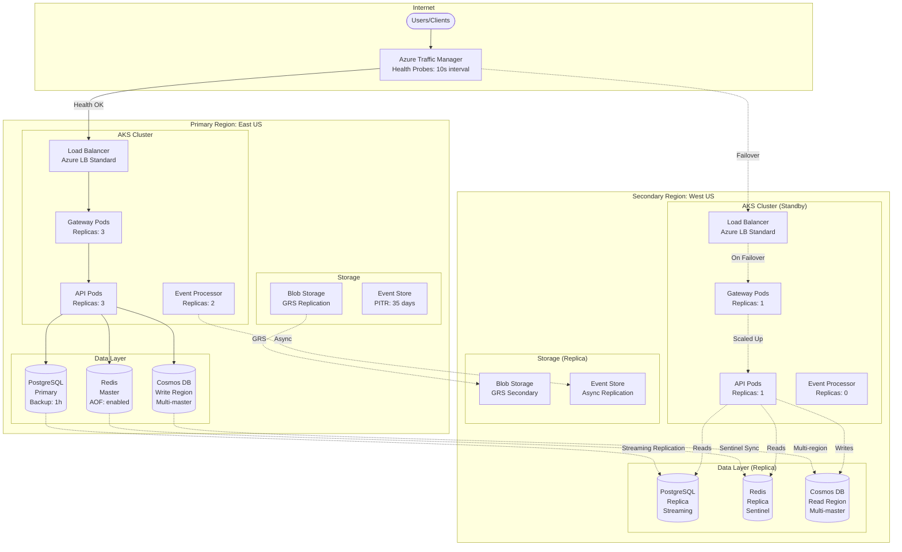
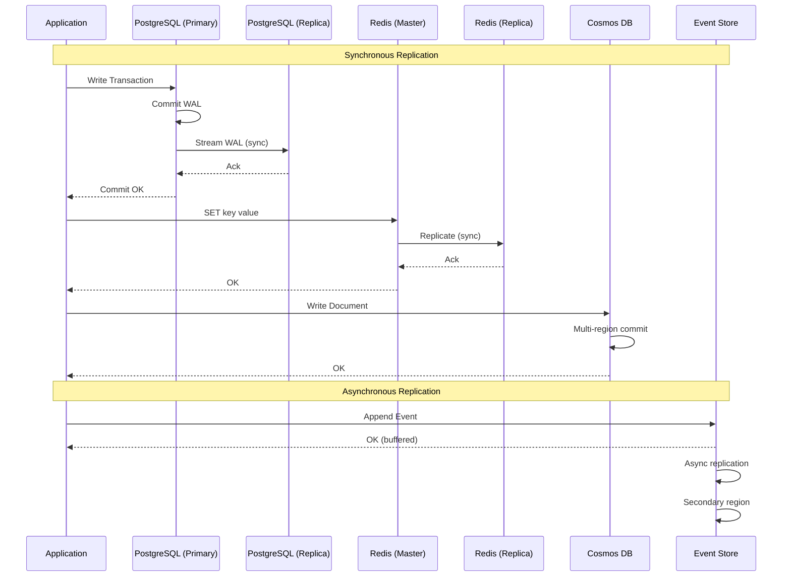
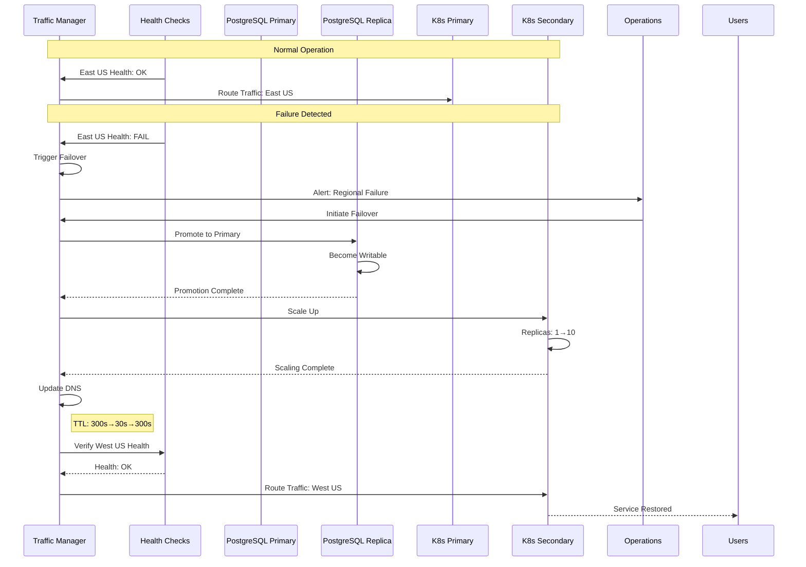
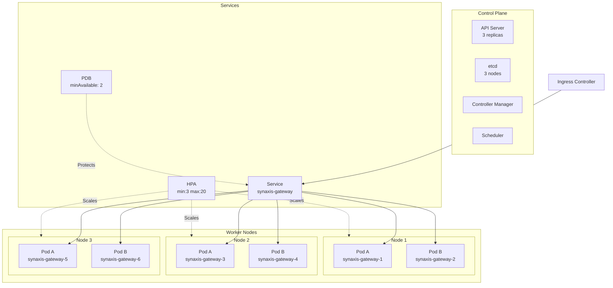
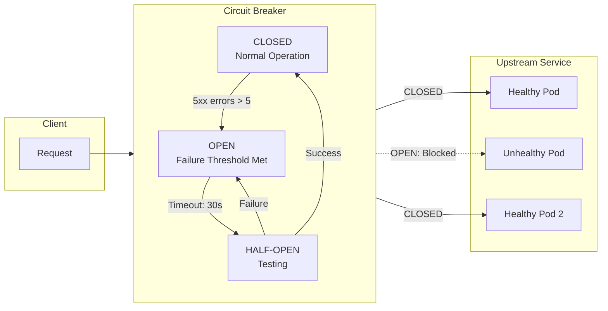
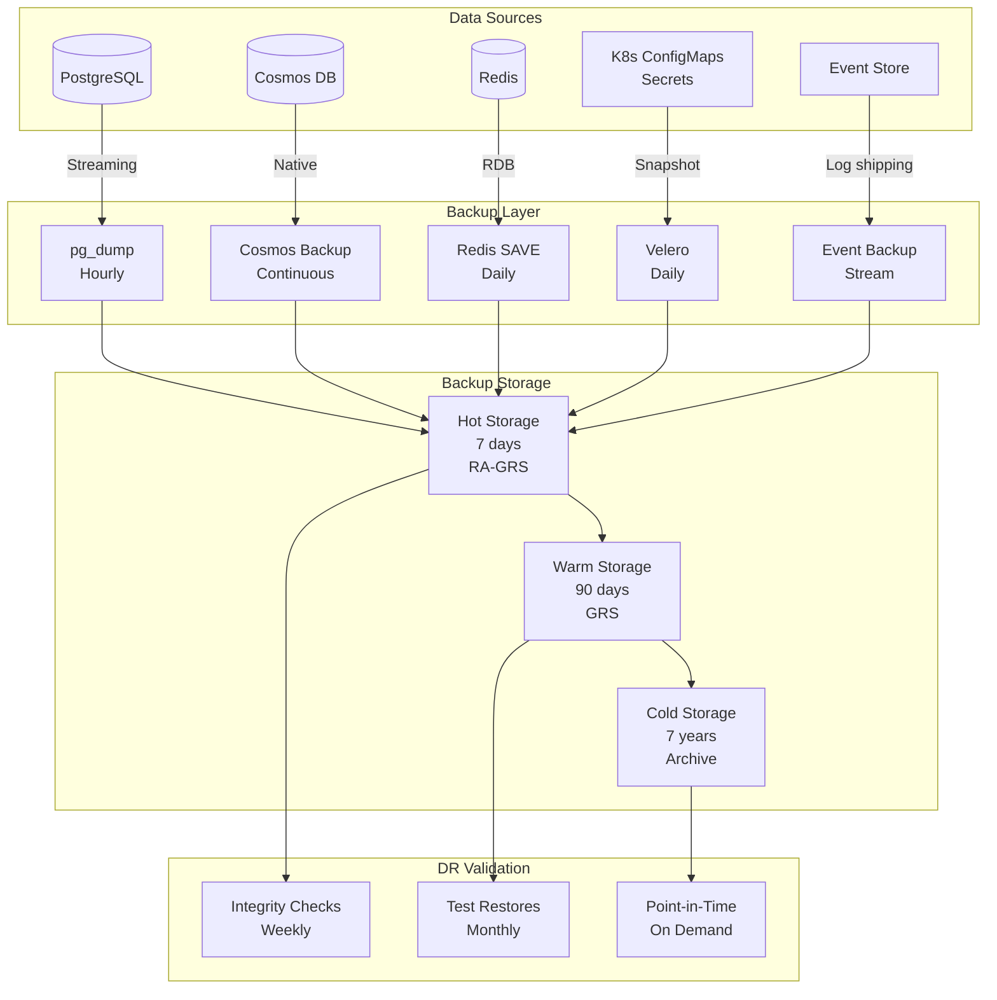
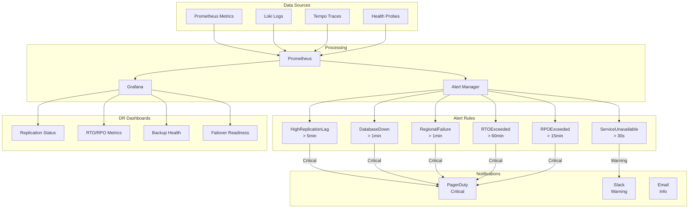

# DR-Enabled Architecture Diagrams

> **Document**: Synaxis-iosz Disaster Recovery Architecture  
> **Version**: 1.0  
> **Last Updated**: 2026-03-04

---

## Table of Contents

1. [Overview](#overview)
2. [Multi-Region Architecture](#multi-region-architecture)
3. [Data Replication Flow](#data-replication-flow)
4. [Failover Sequence Diagrams](#failover-sequence-diagrams)
5. [Component High-Availability](#component-high-availability)
6. [Backup Architecture](#backup-architecture)
7. [Monitoring and Alerting](#monitoring-and-alerting)

---

## Overview

This document provides visual representations of the Synaxis-iosz architecture with Disaster Recovery (DR) capabilities highlighted. All diagrams are annotated with:

- **Primary components** in solid lines
- **Secondary/DR components** in dashed lines
- **Replication flows** in dotted lines
- **Failover paths** in red lines

---

## Multi-Region Architecture



### Region Specifications

| Component | Primary (East US) | Secondary (West US) | RTO | RPO |
|-----------|-------------------|---------------------|-----|-----|
| AKS | 3 replicas | 1 replica (scalable) | 10 min | 0 |
| PostgreSQL | Primary | Streaming Replica | 8 min | 0 |
| Redis | Master | Sentinel Replica | 45s | 0 |
| Cosmos DB | Write Region | Read Region | 12 min | 0 |
| Blob Storage | Primary | GRS Secondary | 5 min | 0 |
| Event Store | Primary | Async Replica | 30 min | 8s |

---

## Data Replication Flow



### Replication Characteristics

```
┌─────────────────────────────────────────────────────────────────┐
│                    REPLICATION TOPOLOGY                          │
├─────────────────────────────────────────────────────────────────┤
│                                                                  │
│   PostgreSQL Streaming Replication                               │
│   ┌──────────┐         ┌──────────┐                             │
│   │ Primary  │═════════│ Replica  │                             │
│   │ East US  │  sync   │ West US  │                             │
│   └──────────┘         └──────────┘                             │
│         │                    │                                  │
│         │                    │                                  │
│         │         ┌──────────┴──────────┐                     │
│         │         │   WAL Archive       │                     │
│         │         │   (Point-in-Time)   │                     │
│         │         └─────────────────────┘                     │
│                                                                  │
│   Redis Sentinel                                                │
│   ┌─────────┐  ┌─────────┐  ┌─────────┐                      │
│   │ Sentinel│  │  Master │  │ Replica │                      │
│   │  26379  │  │  6379   │  │  6380   │                      │
│   └─────────┘  └────┬────┘  └────┬────┘                      │
│                     │            │                              │
│                     └────────────┘                              │
│                          sync                                   │
│                                                                  │
│   Cosmos DB Multi-Master                                        │
│   ┌──────────┐         ┌──────────┐         ┌──────────┐      │
│   │  East US │◄───────►│  West US │◄───────►│  Central│      │
│   │  Write   │  sync   │  Read    │         │         │      │
│   └──────────┘         └──────────┘         └──────────┘      │
│                                                                  │
└─────────────────────────────────────────────────────────────────┘
```

---

## Failover Sequence Diagrams

### Regional Failover Sequence



### Database Failover Timing

```
Time    Event                                              Duration
─────────────────────────────────────────────────────────────────────────
T+0s    Primary failure detected
T+5s    Health check failure confirmed
T+15s   Automated failover initiated (Patroni)
T+30s   Replica promotion begins
T+45s   Write operations accepted on replica
T+60s   Application connection pool recycled
T+90s   Full service restored
─────────────────────────────────────────────────────────────────────────
Total RTO: 90 seconds (1.5 minutes)
RPO: 0 seconds (no data loss)
```

---

## Component High-Availability

### Kubernetes High Availability



### Circuit Breaker Pattern



---

## Backup Architecture



### Backup Schedule

| Component | Frequency | Retention | Type | Storage |
|-----------|-----------|-----------|------|---------|
| PostgreSQL | Hourly | 7 days (hot), 90 days (warm), 7 years (cold) | Logical | GRS |
| PostgreSQL PITR | Continuous | 35 days | WAL | LRS |
| Cosmos DB | Continuous | 30 days | Native | Geo-redundant |
| Redis | Daily | 7 days | RDB | GRS |
| K8s Config | Daily | 30 days | Velero | GRS |
| Event Store | Real-time | 90 days | Stream | GRS |

---

## Monitoring and Alerting



### Key Metrics

| Metric | Target | Warning | Critical |
|--------|--------|---------|----------|
| PostgreSQL Replication Lag | < 1s | > 30s | > 300s |
| Redis Replication Lag | < 100ms | > 1s | > 5s |
| Service Availability | 99.99% | < 99.9% | < 99% |
| Backup Age | < 1h | > 2h | > 4h |
| RTO (Test) | < 60m | N/A | > 60m |
| RPO (Live) | < 15m | > 10m | > 15m |

---

## Sign-off

| Role | Name | Date |
|------|------|------|
| Architect | Platform Team | 2026-03-04 |
| DBA | Database Team | 2026-03-04 |
| SRE | SRE Team | 2026-03-04 |
| Operations | Ops Team | 2026-03-04 |
