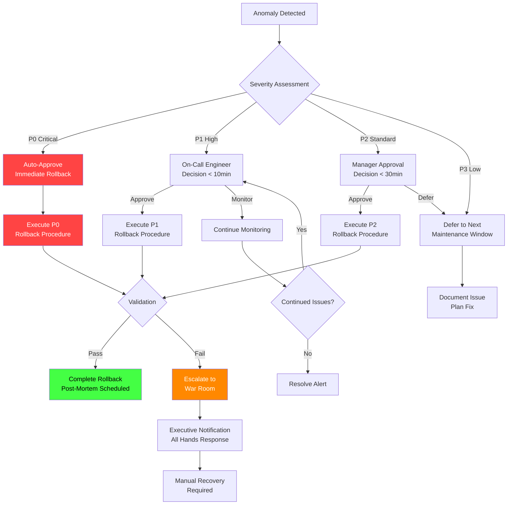
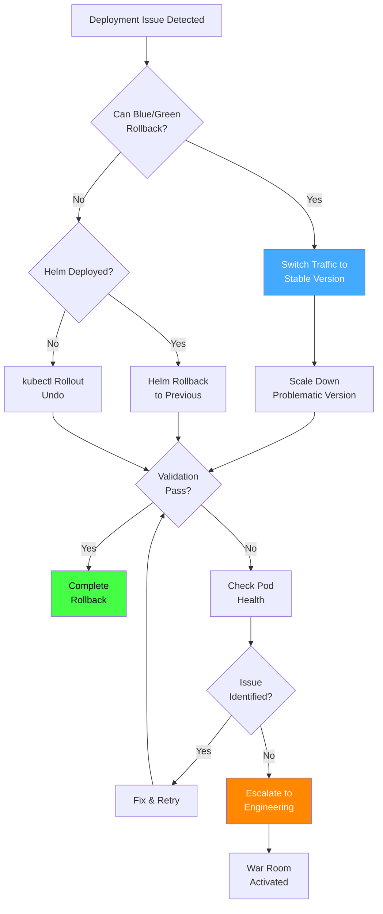
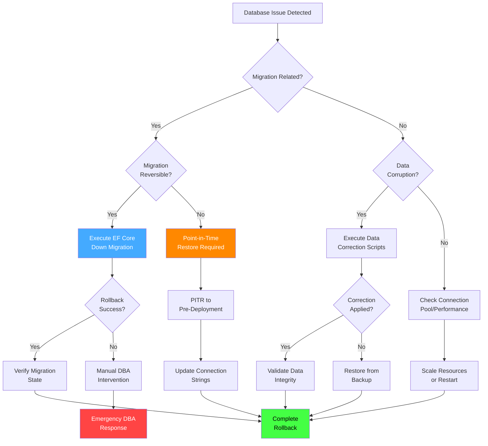
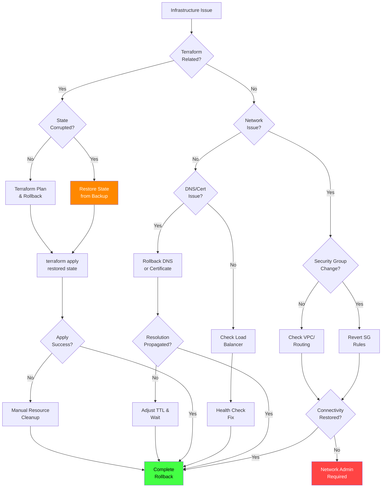
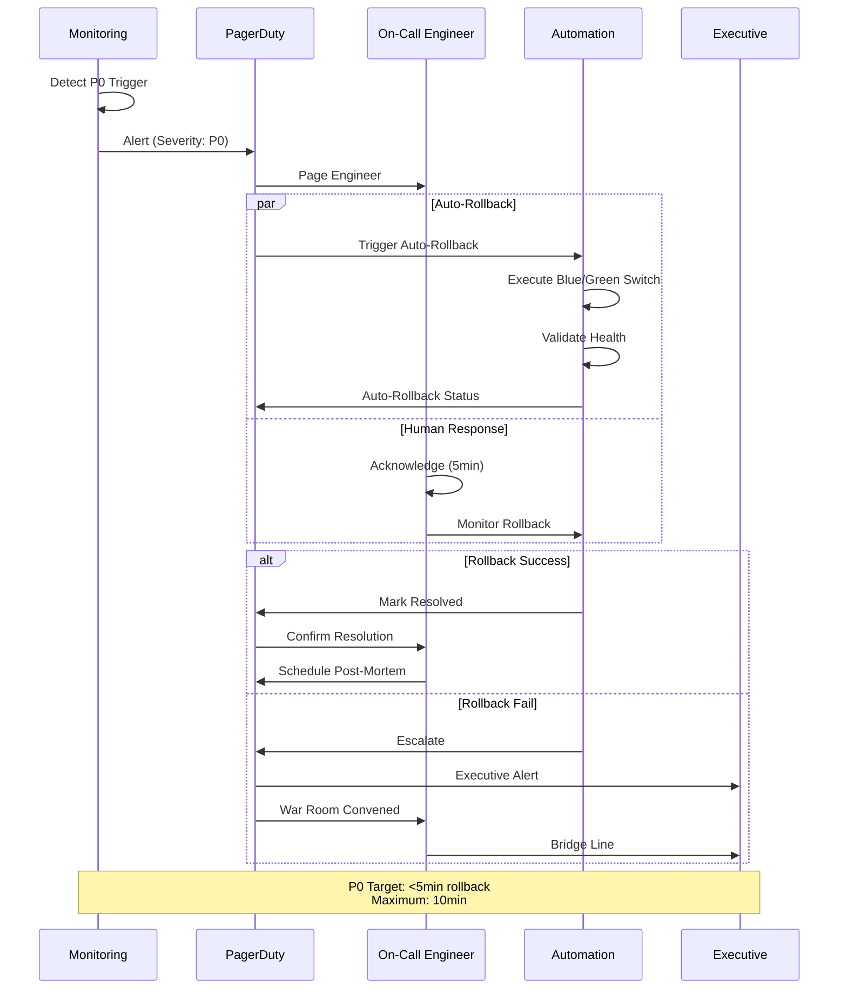
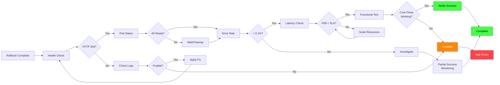
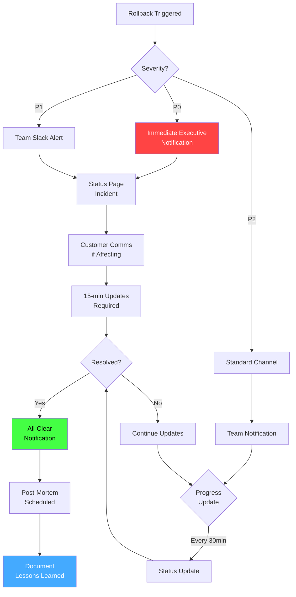

# Synaxis Rollback Decision Flowchart

This document provides visual flowcharts for rollback decision-making.

## Main Rollback Decision Tree

## Application Rollback Decision Flow

## Database Rollback Decision Flow

## Infrastructure Rollback Decision Flow

## P0 Emergency Response Flow

## Rollback Validation Flow

## Time-Based Escalation Matrix

```mermaid
gantt
    title Rollback Response Timeline
    dateFormat X
    axisFormat %s
    
    section Detection
    Auto-Detection        :done, 0, 1
    Alert Fired           :done, 1, 2
    
    section Response
    P0 Auto-Rollback      :crit, 2, 5
    On-Call Response      :active, 2, 7
    Manager Notification  :7, 10
    
    section Decision
    P0 Complete           :milestone, 5, 5
    P1 Decision           :10, 15
    War Room Convened     :crit, 15, 30
    
    section Resolution
    Target Resolution     :milestone, crit, 30, 30
    Max Tolerable         :milestone, crit, 60, 60
```

## Communication Flow

