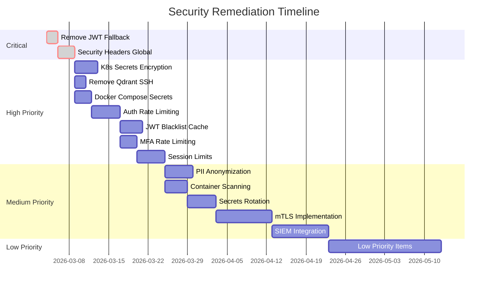

# Synaxis Platform Security Remediation Plan

**Plan Date:** March 4, 2026  
**Version:** 1.0  
**Status:** Draft  
**Owner:** Security Team  

---

## Executive Summary

This remediation plan addresses 34 vulnerabilities identified in the Synaxis platform security audit. The plan is organized by priority and provides detailed implementation steps, timelines, and success criteria.

### Remediation Statistics

| Priority | Total | Critical Path | Estimated Effort |
|----------|-------|---------------|------------------|
| Critical (P0) | 2 | 14 days | 40 hours |
| High (P1) | 8 | 30 days | 120 hours |
| Medium (P2) | 14 | 60 days | 200 hours |
| Low (P3) | 10 | 90 days | 80 hours |

---

## Phase 1: Critical Remediation (0-14 Days)

### P0-001: Remove Hardcoded JWT Secret Fallback

**Vulnerability:** V-001  
**Severity:** 🔴 Critical  
**CVSS:** 9.8  
**Owner:** Security Team  
**Estimated Effort:** 8 hours

#### Current State
```csharp
var jwtKey = configuration["Jwt:Key"] ?? "SuperSecretKeyForDevelopmentPurposesOnly123456";
```

#### Target State
```csharp
var jwtKey = configuration["Jwt:Key"];
if (string.IsNullOrWhiteSpace(jwtKey))
{
    throw new InvalidOperationException(
        "JWT secret must be configured. Set the 'Jwt:Key' configuration value.");
}

if (jwtKey.Length < 32)
{
    throw new InvalidOperationException(
        "JWT secret must be at least 256 bits (32 characters) long.");
}
```

#### Implementation Steps
1. **Modify AuthenticationExtensions.cs**
   - Remove fallback value
   - Add validation for missing configuration
   - Add minimum length validation (32 characters)

2. **Update Tests**
   - Add test for missing JWT configuration
   - Add test for weak JWT secret
   - Verify error messages

3. **Update Documentation**
   - Document JWT secret requirements
   - Add to deployment checklist

4. **Update Infrastructure**
   - Ensure all environments have explicit JWT secrets
   - Rotate existing secrets if using default

#### Success Criteria
- [ ] Application fails to start without JWT secret
- [ ] Application fails to start with weak JWT secret (< 32 chars)
- [ ] All existing environments have explicit secrets
- [ ] Unit tests pass

---

### P0-002: Implement Global Security Headers Middleware

**Vulnerability:** V-002  
**Severity:** 🔴 Critical  
**CVSS:** 8.2  
**Owner:** Platform Team  
**Estimated Effort:** 12 hours

#### Implementation Steps
1. **Create Middleware Class**
   ```csharp
   // src/Synaxis.Api/Middleware/GlobalSecurityHeadersMiddleware.cs
   public class GlobalSecurityHeadersMiddleware
   {
       private readonly RequestDelegate _next;
       private readonly ILogger<GlobalSecurityHeadersMiddleware> _logger;

       public GlobalSecurityHeadersMiddleware(RequestDelegate next, ILogger<GlobalSecurityHeadersMiddleware> logger)
       {
           _next = next;
           _logger = logger;
       }

       public async Task InvokeAsync(HttpContext context)
       {
           var headers = context.Response.Headers;
           
           // Prevent MIME sniffing
           headers.Append("X-Content-Type-Options", "nosniff");
           
           // Prevent clickjacking
           headers.Append("X-Frame-Options", "DENY");
           
           // XSS protection
           headers.Append("X-XSS-Protection", "1; mode=block");
           
           // Referrer policy
           headers.Append("Referrer-Policy", "strict-origin-when-cross-origin");
           
           // Content Security Policy
           headers.Append("Content-Security-Policy", 
               "default-src 'self'; " +
               "connect-src 'self' https:; " +
               "script-src 'self'; " +
               "style-src 'self' 'unsafe-inline'; " +
               "img-src 'self' data: https:; " +
               "font-src 'self' data:;");
           
           // HTTPS enforcement
           headers.Append("Strict-Transport-Security", 
               "max-age=31536000; includeSubDomains; preload");
           
           // Feature permissions
           headers.Append("Permissions-Policy", 
               "accelerometer=(), camera=(), geolocation=(), gyroscope=(), " +
               "magnetometer=(), microphone=(), payment=(), usb=()");
           
           // Certificate transparency
           headers.Append("Expect-CT", "max-age=86400, enforce");
           
           await _next(context);
       }
   }
   ```

2. **Register Middleware**
   ```csharp
   // In Program.cs
   app.UseMiddleware<GlobalSecurityHeadersMiddleware>();
   ```

3. **Create Tests**
   - Verify all headers are present
   - Verify header values
   - Test with various response types

#### Success Criteria
- [ ] All security headers present on all responses
- [ ] Headers verified in integration tests
- [ ] CSP tested with actual application functionality
- [ ] No console errors from CSP violations

---

## Phase 2: High Priority Remediation (15-45 Days)

### P1-003: Enable Kubernetes Secrets Encryption

**Vulnerability:** V-003  
**Severity:** 🟠 High  
**CVSS:** 7.5  
**Owner:** Infrastructure Team  
**Estimated Effort:** 16 hours

#### Implementation Steps
1. **Create Encryption Configuration**
   ```yaml
   # encryption-config.yaml
   apiVersion: apiserver.config.k8s.io/v1
   kind: EncryptionConfiguration
   resources:
     - resources:
         - secrets
       providers:
         - aescbc:
             keys:
               - name: key1
                 secret: <base64-encoded-32-byte-key>
         - identity: {}
   ```

2. **Update EKS Cluster**
   - Modify API server configuration
   - Add `--encryption-provider-config` flag
   - Apply rolling update

3. **Verify Encryption**
   ```bash
   kubectl create secret generic test-secret --from-literal=key=value
   etcdctl get /registry/secrets/default/test-secret | hexdump -C
   ```

4. **Rotate Existing Secrets**
   - Delete and recreate all secrets
   - Verify encryption in etcd

#### Success Criteria
- [ ] All secrets encrypted in etcd
- [ ] New secrets automatically encrypted
- [ ] Decryption works for running pods
- [ ] Backup/restore tested

---

### P1-004: Remove SSH Access from Qdrant

**Vulnerability:** V-004  
**Severity:** 🟠 High  
**CVSS:** 7.2  
**Owner:** Infrastructure Team  
**Estimated Effort:** 4 hours

#### Implementation Steps
1. **Modify Security Group**
   ```hcl
   # Remove SSH ingress rule from aws_security_group.qdrant
   # Option 1: Remove entirely
   # Option 2: Restrict to bastion only
   ```

2. **Create Bastion Host** (if needed)
   ```hcl
   resource "aws_instance" "bastion" {
     # ... configuration
     vpc_security_group_ids = [aws_security_group.bastion.id]
   }
   ```

3. **Update Access Documentation**
   - Document new access procedure
   - Update runbooks

#### Success Criteria
- [ ] SSH port not accessible from private subnets
- [ ] Alternative access method documented
- [ ] Security group rules verified

---

### P1-005: Remove Default Secrets from Docker Compose

**Vulnerability:** V-005  
**Severity:** 🟠 High  
**CVSS:** 7.1  
**Owner:** DevOps Team  
**Estimated Effort:** 8 hours

#### Implementation Steps
1. **Update docker-compose.yml**
   ```yaml
   environment:
     Jwt__Key: ${JWT_SECRET}  # No default value
     JWT_ISSUER: ${JWT_ISSUER}
     JWT_AUDIENCE: ${JWT_AUDIENCE}
   ```

2. **Add Validation Script**
   ```bash
   #!/bin/bash
   validate_secrets.sh
   
   required_vars=("JWT_SECRET" "POSTGRES_PASSWORD" "REDIS_PASSWORD")
   for var in "${required_vars[@]}"; do
     if [[ -z "${!var}" ]]; then
       echo "ERROR: $var is not set"
       exit 1
     fi
   done
   ```

3. **Update Documentation**
   - Document all required environment variables
   - Add to developer onboarding

4. **Update CI/CD**
   - Add secret validation to build pipeline

#### Success Criteria
- [ ] No default secrets in docker-compose.yml
- [ ] Validation script runs before startup
- [ ] Documentation updated
- [ ] CI/CD pipeline validates secrets

---

### P1-006: Implement Authentication Rate Limiting

**Vulnerability:** V-006  
**Severity:** 🟠 High  
**CVSS:** 6.8  
**Owner:** Backend Team  
**Estimated Effort:** 16 hours

#### Implementation Steps
1. **Create Rate Limiting Middleware**
   ```csharp
   public class AuthenticationRateLimitMiddleware
   {
       private readonly RequestDelegate _next;
       private readonly IRateLimitCache _cache;

       public async Task InvokeAsync(HttpContext context)
       {
           if (IsAuthEndpoint(context.Request.Path))
           {
               var key = GetRateLimitKey(context);
               var attempts = await _cache.IncrementAsync(key);
               
               if (attempts > MaxAttempts)
               {
                   context.Response.StatusCode = 429;
                   await context.Response.WriteAsync("Too many attempts");
                   return;
               }
           }
           
           await _next(context);
       }
   }
   ```

2. **Define Rate Limits**
   | Endpoint | Limit | Window |
   |----------|-------|--------|
   | /api/auth/login | 5 | 15 min |
   | /api/auth/login/mfa | 5 | 15 min |
   | /api/auth/forgot-password | 3 | 60 min |
   | /api/auth/register | 5 | 60 min |

3. **Add Tests**
   - Test rate limiting per IP
   - Test rate limiting per user
   - Test reset after window

#### Success Criteria
- [ ] Rate limiting active on all auth endpoints
- [ ] Tests verify rate limiting behavior
- [ ] Monitoring alerts on rate limit hits
- [ ] No false positives for legitimate users

---

### P1-007: Cache JWT Blacklist in Redis

**Vulnerability:** V-007  
**Severity:** 🟠 High  
**CVSS:** 6.5  
**Owner:** Backend Team  
**Estimated Effort:** 12 hours

#### Implementation Steps
1. **Modify AuthenticationService**
   ```csharp
   public async Task<bool> ValidateTokenAsync(string token)
   {
       var tokenId = GetTokenIdFromJwt(token);
       
       // Check Redis first
       var isBlacklisted = await _cache.GetStringAsync($"jwt:blacklist:{tokenId}");
       if (isBlacklisted != null)
       {
           return false;
       }
       
       // Fallback to database
       var inDatabase = await _context.JwtBlacklists.AnyAsync(...);
       if (inDatabase)
       {
           await _cache.SetStringAsync(
               $"jwt:blacklist:{tokenId}", 
               "1",
               new DistributedCacheEntryOptions
               {
                   AbsoluteExpiration = GetTokenExpiration(token)
               });
           return false;
       }
       
       return true;
   }
   ```

2. **Add Cache Invalidation**
   - Clear cache on logout
   - TTL based on token expiration

3. **Monitor Performance**
   - Track cache hit rate
   - Monitor Redis memory usage

#### Success Criteria
- [ ] JWT blacklist checks use Redis
- [ ] Cache hit rate > 95%
- [ ] Database queries reduced
- [ ] No stale entries in cache

---

### P1-008: Add MFA Rate Limiting

**Vulnerability:** V-008  
**Severity:** 🟠 High  
**CVSS:** 6.4  
**Owner:** Backend Team  
**Estimated Effort:** 8 hours

#### Implementation Steps
1. **Modify AuthController**
   ```csharp
   [HttpPost("login/mfa")]
   [RateLimit(Policy = "MfaVerification")]
   public async Task<ActionResult> LoginWithMfa([FromBody] MfaLoginRequest request)
   {
       // Check if user is rate limited
       var key = $"mfa_attempts:{request.Email}";
       var attempts = await _cache.GetIntAsync(key);
       
       if (attempts >= MaxMfaAttempts)
       {
           return StatusCode(429, new { message = "Too many MFA attempts" });
       }
       
       // Verify MFA
       var isValid = await _userService.VerifyMfaCodeAsync(...);
       
       if (!isValid)
       {
           await _cache.IncrementAsync(key, TimeSpan.FromMinutes(15));
           return Unauthorized();
       }
       
       // Success - reset counter
       await _cache.RemoveAsync(key);
       return Ok(result);
   }
   ```

2. **Add Account Lockout**
   - Lock account after 10 failed attempts
   - Require email verification to unlock
   - Notify user of suspicious activity

#### Success Criteria
- [ ] MFA rate limiting active
- [ ] Account lockout after 10 failures
- [ ] Email notifications sent
- [ ] Administrative unlock capability

---

### P1-009: Implement Concurrent Session Limits

**Vulnerability:** V-009  
**Severity:** 🟠 High  
**CVSS:** 6.2  
**Owner:** Backend Team  
**Estimated Effort:** 16 hours

#### Implementation Steps
1. **Modify Authentication Flow**
   ```csharp
   public async Task<AuthenticationResult> AuthenticateAsync(...)
   {
       // ... auth logic ...
       
       var activeSessions = await _context.RefreshTokens
           .CountAsync(rt => rt.UserId == user.Id && !rt.IsRevoked);
       
       if (activeSessions >= MaxConcurrentSessions)
       {
           // Option 1: Deny login
           return AuthenticationResult.MaxSessionsReached();
           
           // Option 2: Revoke oldest
           await RevokeOldestSession(user.Id);
       }
       
       // Continue with token generation
   }
   ```

2. **Add Configuration**
   ```json
   {
     "Session": {
       "MaxConcurrentSessions": 5,
       "RevokeOldestOnLimit": true
     }
   }
   ```

3. **Add UI Controls**
   - Allow users to view active sessions
   - Allow users to revoke sessions
   - Show device/browser info

#### Success Criteria
- [ ] Session limit enforced
- [ ] Oldest session revocation works
- [ ] User can view/revoke sessions
- [ ] Email notification on new device

---

## Phase 3: Medium Priority Remediation (46-90 Days)

### P2-010: PII Anonymization in Audit Logs

**Vulnerability:** V-010  
**Severity:** 🟡 Medium  
**CVSS:** 5.3  
**Owner:** Backend Team  
**Estimated Effort:** 16 hours

#### Implementation
```csharp
public class AuditLogService
{
    private string AnonymizePii(string value, PiiType type)
    {
        return type switch
        {
            PiiType.IpAddress => AnonymizeIp(value),
            PiiType.UserAgent => HashUserAgent(value),
            _ => value
        };
    }
    
    private string AnonymizeIp(string ip)
    {
        // Remove last octet for IPv4
        if (IPAddress.TryParse(ip, out var address) 
            && address.AddressFamily == AddressFamily.InterNetwork)
        {
            var bytes = address.GetAddressBytes();
            bytes[3] = 0;
            return new IPAddress(bytes).ToString() + "/24";
        }
        return ip;
    }
}
```

---

### P2-011: Container Image Scanning

**Vulnerability:** V-016  
**Severity:** 🟡 Medium  
**CVSS:** 4.5  
**Owner:** DevOps Team  
**Estimated Effort:** 12 hours

#### Implementation
```yaml
# .github/workflows/security.yml
name: Security Scan

on: [push, pull_request]

jobs:
  scan:
    runs-on: ubuntu-latest
    steps:
      - uses: actions/checkout@v4
      
      - name: Build image
        run: docker build -t synaxis:${{ github.sha }} .
      
      - name: Run Trivy
        uses: aquasecurity/trivy-action@master
        with:
          image-ref: 'synaxis:${{ github.sha }}'
          format: 'sarif'
          output: 'trivy-results.sarif'
      
      - name: Upload results
        uses: github/codeql-action/upload-sarif@v2
        with:
          sarif_file: 'trivy-results.sarif'
```

---

### P2-012: Implement mTLS

**Vulnerability:** V-018  
**Severity:** 🟡 Medium  
**CVSS:** 4.5  
**Owner:** Infrastructure Team  
**Estimated Effort:** 32 hours

#### Implementation
```yaml
# Istio PeerAuthentication
apiVersion: security.istio.io/v1beta1
kind: PeerAuthentication
metadata:
  name: default
  namespace: synaxis
spec:
  mtls:
    mode: STRICT
---
# DestinationRule
apiVersion: networking.istio.io/v1beta1
kind: DestinationRule
metadata:
  name: synaxis-mtls
spec:
  host: "*.synaxis.svc.cluster.local"
  trafficPolicy:
    tls:
      mode: ISTIO_MUTUAL
```

---

## Phase 4: Low Priority Remediation (91+ Days)

See vulnerability scan results document for low priority items (V-021 through V-030).

---

## Implementation Timeline



---

## Testing Strategy

### Unit Tests
- Each remediation includes unit tests
- Security-specific test cases
- Edge case coverage

### Integration Tests
- End-to-end security flows
- Rate limiting verification
- Session management validation

### Penetration Testing
- Schedule quarterly pentests
- Focus on remediated areas
- Validate fix effectiveness

### Compliance Testing
- Verify GDPR/CCPA compliance
- Audit log integrity
- Data retention policies

---

## Success Metrics

| Metric | Baseline | Target | Timeline |
|--------|----------|--------|----------|
| Critical Vulnerabilities | 2 | 0 | 14 days |
| High Vulnerabilities | 8 | 0 | 45 days |
| Medium Vulnerabilities | 14 | 5 | 90 days |
| Low Vulnerabilities | 10 | 5 | 90 days |
| Security Test Coverage | 60% | 85% | 90 days |
| Mean Time to Remediate | - | 7 days (Critical) | Ongoing |

---

## Risk Assessment

### Remediation Risks

| Risk | Likelihood | Impact | Mitigation |
|------|------------|--------|------------|
| Breaking changes in auth | Medium | High | Feature flags, gradual rollout |
| Performance degradation | Low | Medium | Load testing, monitoring |
| User disruption | Medium | Medium | Communication, maintenance windows |
| Incomplete remediation | Medium | High | Code review, verification |

---

## Approval

| Role | Name | Signature | Date |
|------|------|-----------|------|
| Security Lead | | | |
| CTO | | | |
| Engineering Manager | | | |

---

*Document Version: 1.0*  
*Last Updated: March 4, 2026*
